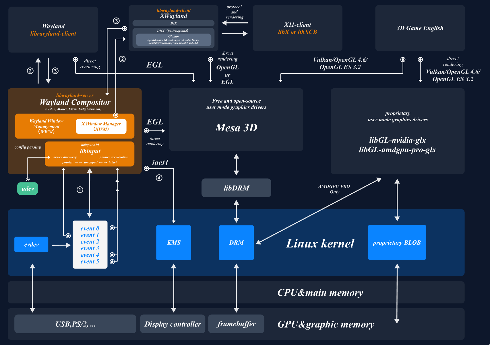
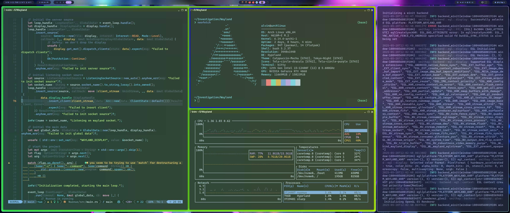

## 进栈不排队 - OS 功能赛道

### Wayland 平铺式桌面管理器

```
███╗   ███╗ ██████╗ ███╗   ██╗██████╗ ██████╗ ██╗ █████╗ ███╗   ██╗
████╗ ████║██╔═══██╗████╗  ██║██╔══██╗██╔══██╗██║██╔══██╗████╗  ██║
██╔████╔██║██║   ██║██╔██╗ ██║██║  ██║██████╔╝██║███████║██╔██╗ ██║
██║╚██╔╝██║██║   ██║██║╚██╗██║██║  ██║██╔══██╗██║██╔══██║██║╚██╗██║
██║ ╚═╝ ██║╚██████╔╝██║ ╚████║██████╔╝██║  ██║██║██║  ██║██║ ╚████║
╚═╝     ╚═╝ ╚═════╝ ╚═╝  ╚═══╝╚═════╝ ╚═╝  ╚═╝╚═╝╚═╝  ╚═╝╚═╝  ╚═══╝
```

### 目录
- [进栈不排队 - OS 功能赛道](#进栈不排队---os-功能赛道)
  - [Wayland 平铺式桌面管理器](#wayland-平铺式桌面管理器)
  - [目录](#目录)
  - [基本信息](#基本信息)
  - [项目简介（图片待更换）](#项目简介图片待更换)
  - [项目运行](#项目运行)
  - [项目结构](#项目结构)
  - [TODO](#todo)
- [参考文件](#参考文件)
- [贡献者](#贡献者)

### 基本信息

- 比赛类型：OS功能赛道：模块实验创新赛道
- 学校名称：杭州电子科技大学
- 队伍编号：T202510336995660
- 队伍名称：进栈不排队
- 队伍成员：
    - 林灿
    - 吴悦怡
    - 陈序
- 指导老师：周旭，王俊美

### 项目简介（图片待更换）

> 本项目的详细技术文档目录在 /wiki/* 下，其中包含了详细的模块设计，解释，测试评估等内容。

本项目基于 [Smithay](https://github.com/Smithay/smithay.git) 使用 `Rust` 开发了一个使用 `Wayland` 协议的平铺式桌面管理器。




截止初赛：

- 代码超 `1.5w` 行，配套文档超 `?` 字。
- 实现 `winit` 与 `tty` 两后端，允许在 `tty` 裸机环境下启动项目，开启图形化界面（目前只支持拥有GPU的设备）。
- 基于二叉树改造 `容器二叉树算法` 实现动态平铺效果，并且使用 `SlotMap` 将查询，插入，删除的时间复杂度降低至 `O(1)` 级别。
- 自定义多种动画效果与渲染效果，手写 `shader` 代码美化界面。

### 项目运行

TODO: Wayland 协议的环境基础配置需求
TODO: Rust 语言的环境基础配置需求

```bash
# 获取源代码
git clone https://github.com/Linermao/Nuonuo.git

cd /Nuonuo

# 初始化配置文件
cargo build

# 直接执行
cargo run

# 导出可执行文件
cargo build --release
```

### 项目结构

```
📦 项目结构
├── 📁 src                  # Rust 源代码目录
│   ├── backend/                # 后端初始化与设备管理
│   ├── config/                 # 键盘快捷键与其他配置文件
│   ├── input/                  # 输入监听相关模块
│   ├── layout/                 # 布局模块
│   ├── manager/                # 二级模块管理
│   ├── protocol/               # Wayland 协议实现模块
│   ├── render/                 # 渲染相关模块
│   ├── utils/                  # 工具函数
│   ├── state.rs                # 全局状态结构体定义
│   └── main.rs                 # 程序入口
├── 📁 resource             # 外部资源文件，如图标、字体等
├── 📁 wiki                 # 技术文档与开发记录
├── 📄 Cargo.toml           # Rust 配置文件，包含依赖与元信息
├── 📄 README.md            # 项目英文说明
└── 📄 README_zh-CN.md      # 项目中文说明与竞赛背景
```

### TODO

- [x] 实现 `winit` 后端启动
- [x] 实现 `xdg_shell` 基本协议
- [x] 实现输入设备的监听与管理
- [x] 实现动态平铺算法
- [x] 实现 `tty` 裸机启动
- [ ] 实现多种平铺算法的热切换与自定义调整
- [ ] 实现软件组布局记忆功能
- [ ] 实现无 `GPU` 渲染

## 参考文件

- [https://github.com/Smithay/smithay](https://github.com/Smithay/smithay)
- [https://github.com/YaLTeR/niri](https://github.com/YaLTeR/niri)
- [https://docs.rs/smithay](https://docs.rs/smithay)
- [https://wayland-book.com/](https://wayland-book.com/)
- [https://wayland.freedesktop.org/docs/html/](https://wayland.freedesktop.org/docs/html/)
- [https://en.wikipedia.org/wiki/Windowing_system](https://en.wikipedia.org/wiki/Windowing_system)
- [https://wayland.app/protocols/](https://wayland.app/protocols/)
- [https://support.touchgfx.com/docs/basic-concepts/framebuffer](https://support.touchgfx.com/docs/basic-concepts/framebuffer)

## 贡献者

- 林灿：[Linermao](https://github.com/Linermao)