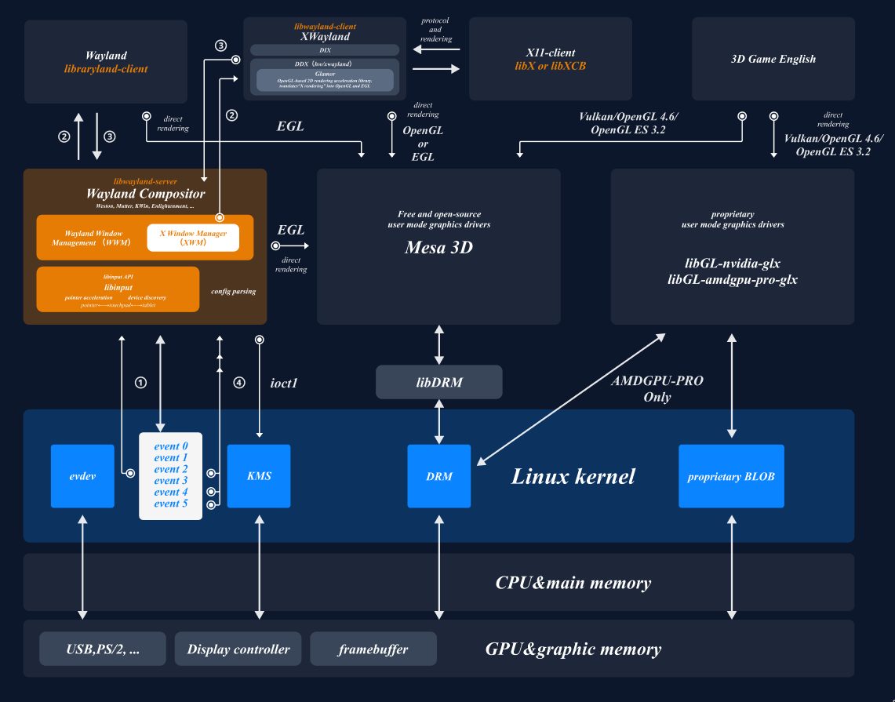
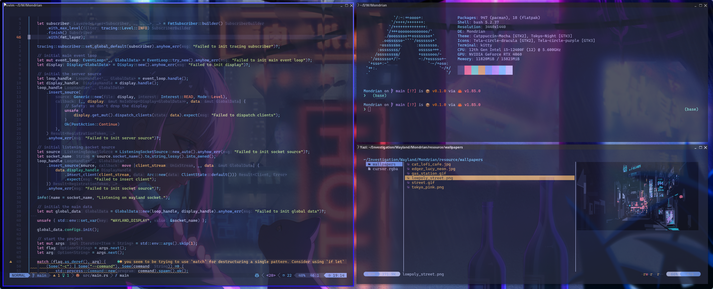
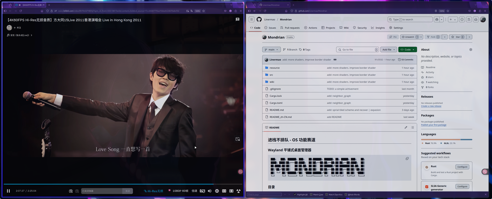

## 进栈不排队 - proj340 - Wayland 平铺式桌面管理器

---

```
███╗   ███╗ ██████╗ ███╗   ██╗██████╗ ██████╗ ██╗ █████╗ ███╗   ██╗
████╗ ████║██╔═══██╗████╗  ██║██╔══██╗██╔══██╗██║██╔══██╗████╗  ██║
██╔████╔██║██║   ██║██╔██╗ ██║██║  ██║██████╔╝██║███████║██╔██╗ ██║
██║╚██╔╝██║██║   ██║██║╚██╗██║██║  ██║██╔══██╗██║██╔══██║██║╚██╗██║
██║ ╚═╝ ██║╚██████╔╝██║ ╚████║██████╔╝██║  ██║██║██║  ██║██║ ╚████║
╚═╝     ╚═╝ ╚═════╝ ╚═╝  ╚═══╝╚═════╝ ╚═╝  ╚═╝╚═╝╚═╝  ╚═╝╚═╝  ╚═══╝
```

### 目录

- [进栈不排队 - proj340 - Wayland 平铺式桌面管理器](#进栈不排队---proj340---wayland-平铺式桌面管理器)
  - [目录](#目录)
  - [基本信息](#基本信息)
  - [项目简介](#项目简介)
  - [项目演示](#项目演示)
  - [项目运行](#项目运行)
  - [项目结构](#项目结构)
  - [TODO](#todo)
- [参考文件](#参考文件)
- [贡献者](#贡献者)


### 基本信息

- 比赛类型：OS功能赛道：模块实验创新赛道
- 学校名称：杭州电子科技大学
- 队伍编号：T202510336995660
- 队伍名称：进栈不排队
- 队伍成员：
  - 林灿
  - 吴悦怡
  - 陈序
- 指导老师：周旭，王俊美


### 项目简介

> 本项目的详细技术文档目录在 wiki 中，其中包含了详细的模块设计，解释，测试评估等内容。

本项目基于 [Smithay](https://github.com/Smithay/smithay.git) 使用 `Rust` 开发了一个使用 `Wayland` 协议的平铺式桌面管理器。项目能够在裸机终端中自行初始化 `DRM/KMS` 图形管线，并通过 `GBM` 和 `EGL` 建立 `GPU` 渲染上下文，使用 `OpenGLES` 进行硬件加速合成显示。启动后该 `Compositor` 接管系统图形输出，并成为客户端程序（如终端模拟器、浏览器）的 `Wayland` 显示服务。



- **设计哲学**

  > “Beauty is the promise of happiness.” — Stendhal

  - 本项目秉持 **“优雅即力量”** 的设计哲学，力求在系统结构与用户体验之间取得和谐平衡。无论是内部代码逻辑还是外部交互呈现，都追求简洁、清晰而富有韵律的表达。

- **代码体量**

  - 累计修改超 **10,000** 行代码，新增 **5,000+** 行，配套文档逾 **20,000** 字，涵盖架构设计、接口协议与开发细节。

- **全栈实现**

  - 实现双后端架构：`winit` 支持桌面环境，`tty` 支持裸机直启，图形界面无需登录管理器，直接运行于 GPU 设备之上。

- **数据结构与算法**

  - 引入改造后的 ***容器式二叉树布局方案***，实现灵活的平铺与窗口变换；结合 `SlotMap` 实现节点的 **常数时间** 复杂度插入、删除与查找，极大提升动态性能。

- **动画与渲染**

  - 自定义过渡动画与渲染逻辑，配合手写 `GLSL` shader，实现流畅、响应式的交互体验，视觉层次统一且精致。


### 项目演示






### 项目运行

Wayland 基础协议配置：

```bash
# archlinux
sudo pacman -S --needed wayland

# ubuntu must use 25.05 or above, don't need any operations

# extra
# fcitx5 输入法安装
sudo pacman -S fcitx5-im fcitx5-chinese-addons fcitx5-rime

# kitty 终端安装
sudo pacman -S kitty
```

项目运行：

```bash
# 获取源代码
git clone https://github.com/Linermao/Mondrian.git

cd /Mondrian

# 初始化配置文件
cargo build

# 直接执行
cargo run

# 导出可执行文件
cargo build --release
```

### 项目结构

```
📦 项目结构
├── 📁 src                  # Rust 源代码目录
│   ├── backend/                # 后端初始化与设备管理
│   ├── config/                 # 键盘快捷键与其他配置文件
│   ├── input/                  # 输入监听相关模块
│   ├── layout/                 # 布局模块
│   ├── manager/                # 二级模块管理
│   ├── protocol/               # Wayland 协议实现模块
│   ├── render/                 # 渲染相关模块
│   ├── utils/                  # 工具函数
│   ├── state.rs                # 全局状态结构体定义
│   └── main.rs                 # 程序入口
├── 📁 resource             # 外部资源文件，如图标、字体等
├── 📁 wiki                 # 技术文档与开发记录
├── 📄 Cargo.toml           # Rust 配置文件，包含依赖与元信息
├── 📄 README.md            # 项目英文说明
└── 📄 README_zh-CN.md      # 项目中文说明与竞赛背景
```

### TODO

- [x] 实现 `winit` 后端启动
- [x] 实现 `xdg_shell` 基本协议
- [x] 实现输入设备的监听与管理
- [x] 实现动态平铺算法
- [x] 实现 `tty` 裸机启动
- [x] 实现多种平铺算法的热切换与自定义调整
- [x] 实现动画效果
- [ ] 实现多显示器（output）的输出逻辑
- [ ] 优化工作区（workspace）的切换逻辑
- [ ] 实现软件组布局记忆功能
- [ ] 实现无 `GPU` 渲染

## 参考文件

- [https://github.com/Smithay/smithay](https://github.com/Smithay/smithay)
- [https://github.com/YaLTeR/niri](https://github.com/YaLTeR/niri)
- [https://docs.rs/smithay](https://docs.rs/smithay)
- [https://wayland-book.com/](https://wayland-book.com/)
- [https://wayland.freedesktop.org/docs/html/](https://wayland.freedesktop.org/docs/html/)
- [https://en.wikipedia.org/wiki/Windowing_system](https://en.wikipedia.org/wiki/Windowing_system)
- [https://wayland.app/protocols/](https://wayland.app/protocols/)
- [https://support.touchgfx.com/docs/basic-concepts/framebuffer](https://support.touchgfx.com/docs/basic-concepts/framebuffer)

## 贡献者

- 林灿：[Linermao](https://github.com/Linermao)