<!-- cover -->

<div style="text-align: center; margin-top: 100px; margin-bottom: 300px;">
    <div>
        
    </div>
    <h1 style="font-size: 36px; font-weight: bold; margin-top: 60px;">Wayland平铺式桌面管理器实现</h1>
    <p style="font-size: 20px; margin-top: 60px;">队伍名：进栈不排队</p>
    <p style="font-size: 20px;">队长：林灿</p>
    <p style="font-size: 20px;">指导老师：周旭，王俊美</p>
    <p style="font-size: 20px;">参赛学校：杭州电子科技大学</p>
</div>

<!-- pages -->

## 1. 项目介绍

### 1.1 项目简介

本项目基于 Smithay 使用 Rust 开发了一个使用 Wayland 协议的平铺式桌面管理器。项目能够在裸机终端中自行初始化 DRM/KMS 图形管线，并通过 GBM 和 EGL 建立 GPU 渲染上下文，使用 OpenGLES 进行硬件加速合成显示。启动后该 Compositor 接管系统图形输出，并成为客户端程序（如终端模拟器、浏览器）的 Wayland 显示服务。

<div style="text-align: center;">
    
    <p style="font-size:14px;">Figure 1.1 项目演示图</p>
</div>

- **设计哲学**
  
  > “Beauty is the promise of happiness.” — Stendhal
  
  - 本项目秉持 **“优雅即力量”** 的设计哲学，力求在系统结构与用户体验之间取得和谐平衡。无论是内部代码逻辑还是外部交互呈现，都追求简洁、清晰而富有韵律的表达。

- **代码体量**
  
  - 累计修改超 **10,000** 行代码，新增 **7,000+** 行，配套文档逾 **20,000** 字，涵盖架构设计、接口协议与开发细节。

- **全栈实现**
  
  - 实现双后端架构：winit 支持桌面环境，tty 支持裸机直启，图形界面直接运行于 GPU 设备之上。

- **数据结构与算法**
  
  - 引入改造后的 ***容器式二叉树布局方案***，实现灵活的平铺与窗口变换；结合 SlotMap 实现节点的 **常数时间** 复杂度插入、删除与查找，极大提升动态性能。

- **动画与渲染**
  
  - 自定义过渡动画与渲染逻辑，配合手写 GLSL shader，实现流畅、响应式的交互体验，视觉层次统一且精致。

### 1.2 项目开发进度

#### 🎯 项目启动与协议实现

- [x] 实现 `winit` 后端启动

- [x] 实现 `tty` 后端启动

- [ ] 实现无 `GPU` 渲染（基于 CPU software rendering）

- [x] 实现 `xdg_shell` 基本协议支持

- [x] 实现 `layer_shell` 基本协议支持

- [ ] 实现 `xwayland` 基本协议支持

#### 🧩 输入设备管理

- [x] 实现鼠标，键盘的监听与管理

- [x] 实现键盘快捷键响应

- [x] 实现 keybindings.conf 自定义键盘快捷键

- [x] 实现使用键盘控制窗口的移动与布局

- [ ] 实现使用鼠标进行窗口的移动与缩放

- [ ] 实现拓展设备的输入监听 - 触摸板，手写板，VR设备等

- [ ] 实现多套输入设备的处理机制，避免冲突

#### 🪟 窗口与布局管理

- [x] 实现基本的平铺式布局（跟随鼠标 focus）
  
  - [x] 实现 **二叉容器树** 数据结构，实现插入，删除基本窗口操作
  
  - [x] 实现 全局邻接表 数据结构，实现对邻居窗口的方向感知

- [ ] 实现多种平铺算法的热切换与自定义调整
  
  - [x] 动态平铺算法（NeighborGraph）
  
  - [x] 添加 Spiral 布局方案
  
  - [ ] 切换与自定义机制

- [ ] 实现多显示器（output）的输出逻辑
  
  - [x] 自动发现输出设备
  
  - [ ] 独立管理每个 output 的 layout / workspace

- [ ] 优化工作区（workspace）的切换逻辑
  
  - [x] 每个 output 绑定一个默认 workspace
  
  - [ ] 跨 output 的 window 移动逻辑

- [ ] 实现 tiled 与 floating 窗口的互换与共存

- [ ] 优化 popups 管理逻辑，允许其成为 floating 窗口

#### 🎨 美化效果

- [x] 实现动画效果（窗口动画 / 过渡效果）

- [x] 实现更好的 focus 边框效果（呼吸状态 / 颜色渐变）

- [x] 实现 swww 壁纸设置

- [ ] 实现 waybar 状态栏设置

#### 🧠 状态与记忆功能

- [ ] 实现软件组布局记忆功能
  
  - [ ] 支持软件 ID 分组（如 terminal + browser）
  
  - [ ] 保存并恢复各窗口位置、大小、浮动状态

#### 🧭 性能测试与优化

- [ ] 使用 tracing 进行事件信息追踪

- [ ] 使用 tracing 进行事件耗时追踪

- [ ] 实现 GPU 渲染优化

## 2. 赛题描述

### 2.1 Linux 图形栈

在 Linux 操作系统中，图形显示系统由多个层级组成，从底层的内核显卡驱动到用户态的图形协议，再到最终的 GUI 应用。整个图形栈主要包括以下几部分：

- **内核层（Kernel Space）**：
  
  - **DRM**（Direct Rendering Manager）：管理 GPU 资源与帧缓冲控制。
  - **KMS**（Kernel Mode Setting）：用于设置显示模式，如分辨率、刷新率等。
  - **GBM**（Generic Buffer Management）：用于创建与管理图形缓冲区。

- **中间层**：
  
  - **Mesa**：用户态 OpenGL/Vulkan 实现，提供图形驱动接口。
  - **EGL**：抽象图形上下文与窗口系统之间的接口，衔接 OpenGL 与窗口系统（如 Wayland）。

- **用户层协议（User Space Protocol）**：
  
  - **X11**：传统的图形协议，拥有复杂的客户端-服务器模型。
  - **Wayland**：现代协议，注重简洁、高效、低延迟。

- **图形服务器（Display Server）**：
  
  - **Xorg：X11** 协议的标准实现。
  - **Wayland Compositor**：Wayland 协议的实现方，集成合成器、窗口管理器、输入系统。

- **应用层**：
  
  - GUI 应用程序通过协议与服务器通信，实现窗口创建、绘图与事件交互。

<div style="text-align: center;">
    
    <p style="font-size:14px;">Figure 2.1 人机交互</p>
</div>

<div style="text-align: center;">
    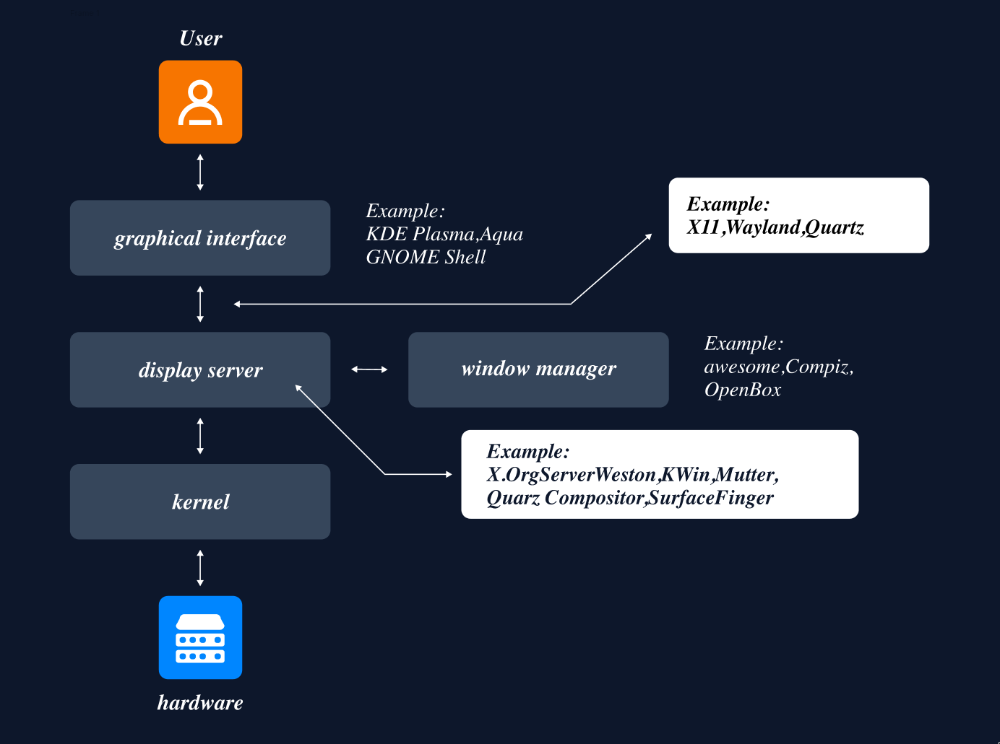
    <p style="font-size:14px;">Figure 2.2 linux 图形栈</p>
</div>

### 2.2 X11 协议

X11 是诞生于 1984 年的图形窗口系统，其核心是 **客户端-服务器** 架构：

- **X Server**：运行在用户机器上，控制显示硬件，处理输入事件。
- **X Clients**：运行应用程序，向 X Server 请求窗口资源，并响应事件回调。

X11 协议支持网络透明性，即 X Client 和 X Server 可以运行在不同主机上。但其通信模型较为复杂：

- 每个窗口请求都需往返服务器确认（Round Trip），带来额外延迟。
- 图形渲染与窗口管理被分离为多个组件（如 WM、Compositor、Toolkit），难以协调。
- 输入事件先由 X Server 捕获，后由 Window Manager 转发，路径冗长且易出现冲突。

尽管历经多年优化，X11 的架构问题已难以适应现代图形性能与安全性的需求。

<div style="text-align: center;">
    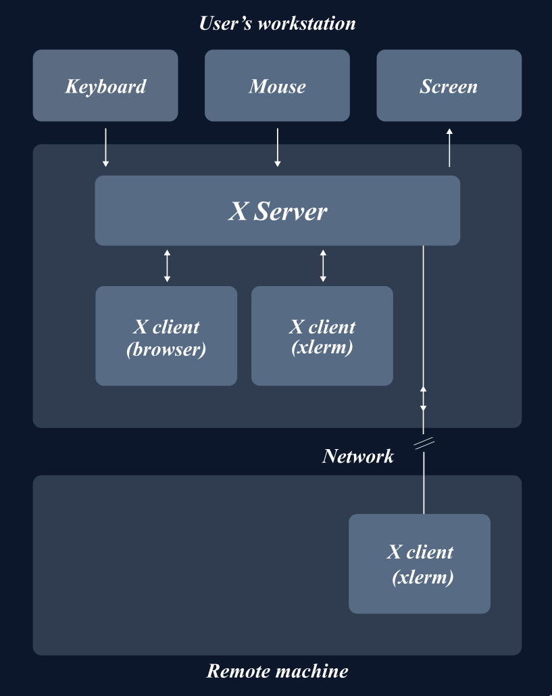
    <p style="font-size:14px;">Figure 2.3 x11 协议演示图</p>
</div>

### 2.3 Wayland 协议

Wayland 是设计用于替代 X11 的现代图形协议，由 [wayland.freedesktop.org](https://wayland.freedesktop.org) 开发，强调 **简洁、安全、高性能**。其基本架构如下：

- **Compositor（合成器）即 Display Server**：
  
  - 直接管理窗口、图像合成与缓冲交换。
  - 处理输入事件，并直接分发到正确的客户端。
  - 实现窗口管理逻辑（如平铺、浮动等）。

- **Client 应用程序**：
  
  - 负责自行渲染窗口内容（通过 GPU 渲染或 CPU 绘图）。
  - 使用 `wl_surface` 等原语将渲染结果提交给 Compositor。
  - 与 Compositor 通过共享内存或 DMA Buffer 实现高效图像交换。

- **协议交互机制**：
  
  - 基于 Unix Domain Socket 通信，使用 `wl_display` 进行连接。
  - 使用对象-事件模型（Object/Interface），类似面向对象远程调用。
  - 无需往返确认，大部分请求为异步执行，提高响应效率。

<div style="text-align: center;">
    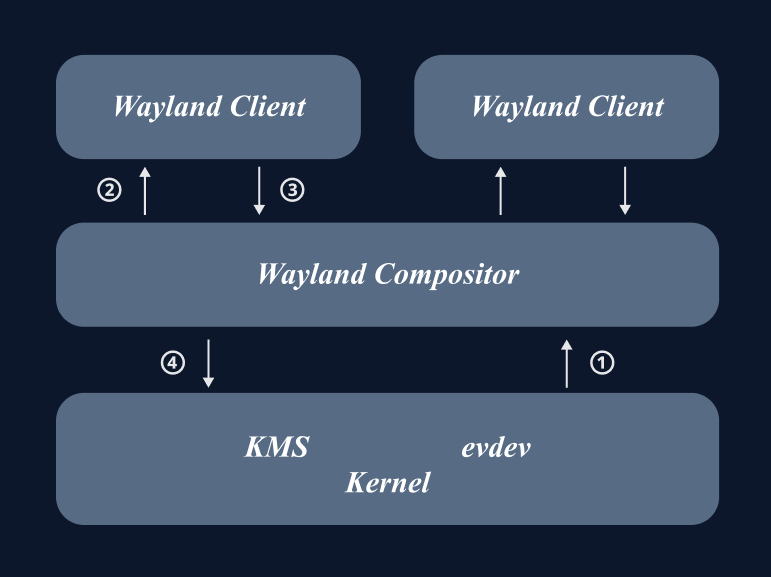
    <p style="font-size:14px;">Figure 2.4 wayland 协议演示图</p>
</div>

#### Wayland 协议的优势

相比 X11，Wayland 协议具有以下核心优势：

##### 简洁的架构设计

Wayland 取消了中间代理（如 Xlib/XCB），让客户端直接负责渲染，Compositor 仅做图像合成与事件路由。这种 **单一控制点设计** 更加清晰易控。

##### 异步通信模型

大多数请求为 **异步非阻塞**，大幅降低绘制窗口所需的 round-trip，提升性能表现，尤其在高帧率与多窗口场景下优势明显。

##### 安全性与隔离性更好

- Compositor 全面控制窗口焦点、输入与输出，不再暴露全局窗口信息。
- 各客户端窗口互不可见（无法监听或操作其他窗口）。
- 支持权限隔离（如输入抓取限制、屏幕截图权限控制等）。

##### 动态扩展能力强

Wayland 协议采用模块化设计，核心协议只定义基础对象（如 `wl_surface`, `wl_output`），其他功能由 **扩展协议（Protocol Extensions）** 提供，例如：

- `xdg-shell`：提供桌面窗口接口（如 toplevel/popup）。
- `wlr-layer-shell`：支持桌面元素（如面板、壁纸）。
- `xdg-output`：扩展输出信息。
- `pointer-gestures`：添加手势支持。

##### 原生合成支持

每个窗口的图像由 Client 渲染后交给 Compositor 直接合成，因此：

- 减少了冗余图层绘制流程。
- 更容易实现视觉效果（圆角、阴影、动画）。
- 支持真正的无撕裂与高刷新率渲染。

### 2.4 平铺式桌面布局协议

传统的桌面环境普遍采用**堆叠式（Stacking）窗口管理模型**，其核心思想是通过层叠多个可自由移动和缩放的窗口，来完成用户的窗口组织。窗口的可见性与交互依赖于 Z 轴层级与遮挡关系。虽然灵活直观，但在窗口数量增多、频繁切换任务时，这种模型容易导致空间浪费、管理混乱、用户认知负担增大，不利于快速切换和管理窗口。

相比之下，**平铺式（Tiling）窗口管理**是一种高度结构化的布局方式，**屏幕被划分为若干区域，每个窗口占据一个不重叠的矩形区域**，并根据特定的布局算法自动排列。其核心原则是：

> 在任何时刻，所有活动窗口在空间上无重叠，完全平铺填充屏幕空间。

1. **窗口自动布局**  
   每当有新窗口创建，它不会以浮动方式出现，而是根据当前焦点窗口的位置与所选布局算法（如垂直分裂、水平分裂、主从结构等）自动插入到屏幕分区中。

2. **无重叠区域，最大化利用空间**  
   所有窗口矩形区域互不重叠，窗口大小由布局决定而非用户拖拽（当然存在平铺式与堆叠式一同使用的情况，允许鼠标进行一定的操作），避免空间浪费。

3. **键盘优先交互**  
   平铺管理器强调键盘操控，通过快捷键进行窗口聚焦、移动、交换、调整布局比例等操作，效率远高于传统的鼠标驱动方式。

4. **一致性与可预测性**  
   所有布局变化均可通过布局算法精确复现，不依赖“拖拽”或“随机叠放”这种不可重现的行为，便于自动化与脚本控制。

<div style="text-align: center;">
    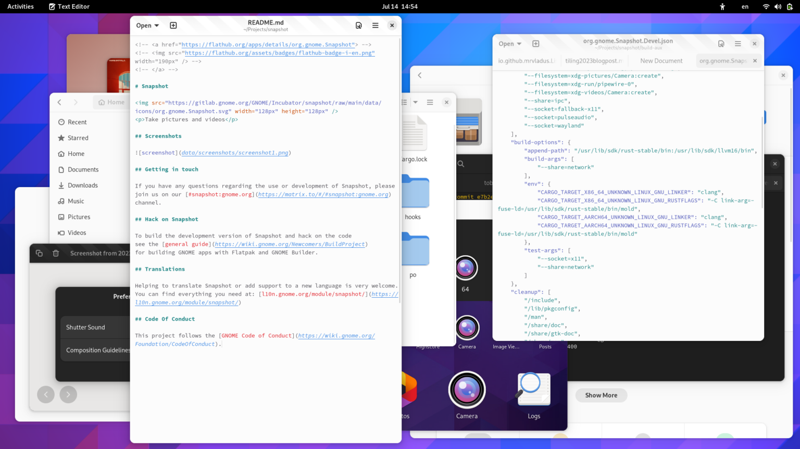
    <p style="font-size:14px;">Figure 2.5 堆叠式演示图（图源gnome）</p>
</div>

<div style="text-align: center;">
    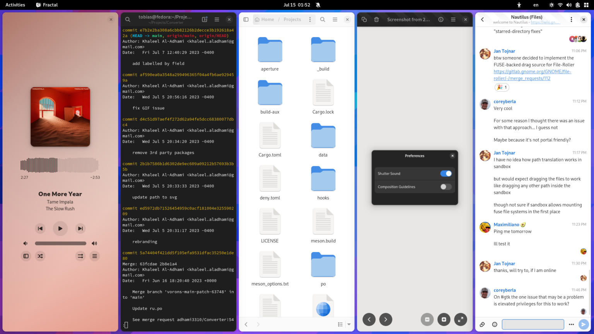
    <p style="font-size:14px;">Figure 2.6 平铺式演示图（图源gnome）</p>
</div>

#### 与堆叠式的对比分析：

| 特性    | 堆叠式窗口管理    | 平铺式窗口管理   |
|:-----:|:----------:|:---------:|
| 布局方式  | 自由拖放、重叠    | 自动分区、无重叠  |
| 控制方式  | 鼠标驱动为主     | 键盘驱动为主    |
| 空间利用  | 易出现空白、遮挡   | 全屏利用、结构紧凑 |
| 一致性   | 不确定性大，难以重现 | 可预测、可脚本化  |
| 多任务效率 | 难管理，易干扰    | 高效、清晰、结构化 |

#### Wayland 合成器中的实现考量：

Wayland 协议本身并**不规定窗口如何布局**，它只负责客户端与合成器之间的通信（例如窗口创建、绘制 buffer、输入事件等）。因此，在构建一个基于 Wayland 的平铺式窗口管理器时，需要在合成器层实现一套**布局逻辑与状态管理机制**，包括但不限于：

- **窗口容器结构设计**：常见有二叉树（如 i3）、嵌套链表、图结构等。Mondrain 项目采用基于**邻接关系的图结构**，相比树形布局在插入、删除、调整窗口大小时具有更强的灵活性与性能。

- **聚焦与导航机制**：需要维护窗口之间的上下左右关系，支持方向性聚焦切换、历史栈导航等。

- **几何计算与输出映射**：根据布局算法计算窗口的矩形区域，并将其绑定到对应的输出设备和 surface。

- **协议协作**：与 `xdg-shell`, `wl_seat`, `xdg-output`, `layer-shell` 等 Wayland 扩展协议协同，实现窗口生命周期管理、输入焦点转发、多输出支持等功能。

## 3. 项目设计与实现

### 3.1 技术选型： Rust 与 Smithay

在构建一个现代、高性能且结构清晰的 Wayland 合成器时，底层语言与基础框架的选型直接决定了项目的可维护性、稳定性与扩展能力。`Mondrain` 的核心目标是实现一个**面向未来的**、**结构可控**的平铺式桌面环境，因此我们选择了 **Rust** 作为主要开发语言，并基于 **Smithay** 框架进行构建。这一组合在性能、可靠性、安全性和协议支持方面表现出极高的适配性。

#### 🦀 为什么选择 Rust？

Rust 是一门强调安全性与并发性能的系统级语言，具备以下几个关键优势，使其特别适合构建图形协议栈与桌面管理器：

1. **内存安全（Memory Safety）**
   
   - Rust 通过所有权系统与静态借用检查器，在编译期保障内存访问合法性，杜绝 Use-After-Free、空指针解引用等常见错误，无需垃圾回收器。
   
   - 对于一个合成器来说，这意味着在处理 surface 生命周期、buffer 引用、输入事件时可以避免大量运行时错误。

2. **数据并发性（Fearless Concurrency）**
   
   - Rust 支持无数据竞争的并发操作，允许我们在后台异步处理输入事件、合成器状态更新与渲染流程，确保交互响应流畅且线程安全。

3. **零成本抽象与可组合性**
   
   - Rust 的类型系统强大，泛型、trait 系统让我们能构建模块化的组件接口，同时不会引入额外的性能开销。
   
   - Mondrain 的核心模块（如 layout 管理器、输入调度器等）均以 trait 抽象方式组织，便于后续扩展和重构。

4. **丰富的生态与 tooling**
   
   - cargo、clippy、rust-analyzer 等工具提供了出色的开发体验和持续集成支持，便于维护大型项目。
   
   - 与 Mesa、WGPU、EGL 等图形库的绑定日趋成熟，为集成硬件加速渲染提供了良好基础。

#### 📦 为什么选择 Smithay？

Smithay 是一个专为构建 Wayland 合成器而设计的 Rust 框架，提供了协议实现、后端抽象、渲染集成等基础模块。它不是一个完整的 window manager，而是一个**合成器构建工具箱**。其优势主要体现在以下几个方面：

1. **模块化设计**
   
   - Smithay 拆分为多个可选模块，如 `wayland-backend`, `wayland-protocols`, `renderer`, `input`, `output` 等。
   
   - Mondrain 只引入所需部分，例如：我们使用自定义 layout 模块替代了默认空间管理逻辑，仅使用 Smithay 的协议处理与输入模型。

2. **Wayland 协议支持广泛**
   
   - 支持核心协议如 `wl_compositor`, `wl_seat`, `xdg-shell`，并集成 `xdg-output`, `layer-shell`, `wlr-protocols` 等常见扩展。
   
   - 可以在合成器层自由定制协议行为，例如限制窗口行为、插入布局钩子等。

3. **后端抽象能力**
   
   - 支持多个图形后端（EGL, GLES2, WGPU）、输入后端（Winit、libinput）与输出设备管理（DRM/KMS、virtual output）。
   
   - 允许在不同平台（如嵌入式、TTY、X11）运行，底层支持度高。

4. **灵活可插拔架构**
   
   - 不像 Weston 或 wlroots 那样强绑定窗口管理逻辑，Smithay 允许合成器设计者自行定义事件循环、窗口模型与渲染策略，非常适合实现平铺式或动态布局系统。

5. **社区活跃、长期演进**
   
   - Smithay 拥有稳定的维护团队，与 Mesa、wlroots 社区保持良好协作，能持续跟进最新的 Wayland 标准与实践。

<div style="text-align: center;">
    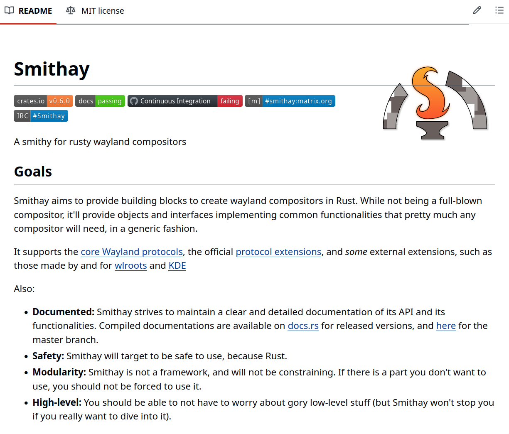
    <p style="font-size:14px;">Figure 3.1 smithay github</p>
</div>

### 3.2 最小 wayland compositor 实现

#### 1️⃣ 架构概览

Smithay 采用 `calloop` 作为主事件循环框架，其优势在于：

- 可插拔式事件源管理（source registration）
- 高性能的非阻塞式事件分发
- 原生支持定时器、通道等常用异步通信模型

`Smithay` 为 `Winit` 后端提供了优秀的兼容模式，可以很方便的进行开发。

#### 2️⃣ EventLoop 事件分发机制

在基于 `Smithay` 构建的 `Wayland Compositor` 中，`事件循环（EventLoop）`是整个系统运行的核心。所有的输入、输出、客户端请求、时间驱动逻辑，乃至后台任务的调度都依赖于该机制完成事件的监听与响应。

##### 定义

在 `main` 函数中定义一个 `EventLoop` 主体非常简单，直接调用相关的库函数：

```rust
use smithay::reexports::calloop::EventLoop;
let mut event_loop: EventLoop<'_, State> = EventLoop::try_new().unwrap();
```

在这里，`State` 类型是全局状态结构体，由我们自己定义，目前暂时不谈论细节，你只需知道这个结构体管理所有的程序状态即可。

##### 事件源插入

通过获取 `LoopHandle` 就来执行事件的插入，删除与执行操作：

```rust
event_loop
    .handle() // LoopHandle
    .insert_source(input_backend, move |event, &mut metadata, state| {
        // action
    })?;
```

在这里，我们通过 `handle()` 函数获取操作入口，使用 `insert_source` 函数来注册 `事件源（EventSource）`，其会将一个监听对象添加到主循环中，并且绑定一个处理函数（回调闭包），每当事件产生时，就会调用这个函数。

事件循环可以绑定多个事件源，常见类别如下：

| 类型          | 来源              | 示例事件                        |
| ----------- | --------------- | --------------------------- |
| 输入设备        | libinput        | PointerMotion、KeyboardKey 等 |
| 图形输出        | DRM/KMS, Winit  | 热插拔、显示尺寸改变                  |
| Wayland 客户端 | WaylandSocket   | 请求窗口创建、buffer attach        |
| 定时器         | calloop Timer   | 动画帧调度、超时                    |
| 自定义通道       | calloop Channel | 后台任务返回、信号触发                 |

在 `insert_source` 中绑定的回调闭包具有以下签名：

```rust
FnMut(E, &mut Metadata, &mut State)
```

- `E`: 来自事件源的事件本体，类型依赖于事件源。
- `Metadata`: 事件元信息（通常是 `calloop::generic::GenericMetadata`），包含事件触发时的底层 I/O 状态，例如可读/可写标志。大多数情况下你可以忽略该参数，除非你要做更底层的 I/O 操作。
- `State`: 传入的全局状态对象，是你自定义的全局状态结构，也就是一开始定义的类型 `EventLoop<'_, State>` 中的 `State`。

*或许你会疑惑我们只是告诉了 `EventLoop` 的 `State` 类型，没有实现 `State` 值的传入，为什么这里可以获取到一个可变借用，别着急，后面就会揭晓答案*

最容易理解的就是客户端连接请求的事件处理：

```rust
let source = ListeningSocketSource::new_auto().unwrap();
let socket_name = source.socket_name().to_string_lossy().into_owned();
loop_handle
    .insert_source(source, move |client_stream, _, state| {
        state
            .display_handle
            .insert_client(client_stream, Arc::new(ClientState::default()))
            .unwrap();
    })
    .expect("Failed to init wayland socket source.");
```

`Wayland` 是一个基于 `UNIX 域套接字（UNIX domain socket）` 的通信协议，`Client` 与 `Compositor` 之间的所有协议交互，都是通过一个共享的本地套接字进行的。

`ListeningSocketSource::new_auto()` 会自动创建一个新的 `UNIX 域套接字`，并监听客户端连接请求。默认在 `/run/user/UID/` 下创建 `socket` 文件，例如 `wayland-0`.本地调试时我们需要设置环境变量 `WAYLAND_DISPLAY=wayland-0` 来绑定测试的 `Compositor`。

当有客户端连接或请求发生时，对应的事件将触发该回调闭包，并调用 `.display_handle.insert_client` 以执行客户端初始化、资源绑定或协议处理等逻辑。

详细的创建内容在 Client事件源 篇会详细讲解。

##### 事件执行

此前我们只是将需要监听的事件源和需要执行的函数内容加入到了 `EventLoop` 中，但还未真正的下达指令 - 你可以开始监听了，因此，我们还需要以下代码来真正开启循环：

```rust
event_loop
    .run(None, &mut state, move |_| {
        //  is running
    })
    .unwrap();
```

此时，我们可以解答在事件源插入中遗留的问题了，可变借用是此时才被传入其中的，顺序上也许会让人疑惑，但这就是 Rust 的“延迟状态绑定”机制的奇妙之处。

在调用 `insert_source` 时，事件循环尚未开始运行，只是注册了事件源与回调；

所有回调的 `state` 参数类型由 `EventLoop<T>` 的泛型 T 决定（例如我们定义的 `State`），但值本身尚未存在；

直到调用 `run(&mut state, ...)` 这一刻，`state` 的实际引用才被注入到事件循环中；

从此刻开始，`calloop` 内部在每次事件分发时，才会将这个 `&mut T` 传入闭包中。

它确保了事件循环中所有 `state` 的使用都在 `run()` 的生命周期范围内发生，且绝不会出现悬垂引用或数据竞争。

至此，核心的框架就已经被我们解决了，接下来就是真正的进行对不同事件源的处理。

#### 3️⃣ Client 事件源

在 `Wayland` 协议中，客户端的渲染行为是以 `wl_surface` 为基本单位的。每一个客户端窗口本质上都是在创建并提交一个或多个 `surface`，而这些 `surface` 的行为则由其绑定的角色（如 `xdg_toplevel` 或 `xdg_popup` ）所定义。

在之前我们已经见过以下的代码：

```rust
let source = ListeningSocketSource::new_auto().unwrap();
let socket_name = source.socket_name().to_string_lossy().into_owned();
loop_handle
    .insert_source(source, move |client_stream, _, state| {
        state
            .display_handle
            .insert_client(client_stream, Arc::new(ClientState::default()))
            .unwrap();
    })
    .expect("Failed to init wayland socket source.");
```

这段代码创建了一个新的 `UNIX 域套接字`，监听客户端的连接请求。`Wayland` 是一个 `拉模型（pull model）`，客户端不会主动创建窗口，而是从服务端请求对象并获得引用。其中具体的请求过程如下：

- 连接 `display socket`：客户端连接 `compositor` 暴露的 `UNIX 域套接字`（如 `/run/user/1000/wayland-0`）。
- 绑定 `wl_registry`：连接后，客户端首先获取 `wl_display` 提供的 `wl_registry` `对象，它包含了compositor` 所支持的所有全局对象（如 `wl_compositor`、`wl_shm`、`xdg_wm_base` 等）。
- 获取 `wl_compositor` 接口：客户端通过 `wl_registry.bind(...)` 获得 `wl_compositor` 接口，允许创建 `wl_surface`。
- 创建 `wl_surface`：客户端通过 `wl_compositor.create_surface()` 调用，获得一个新的 `surface` 例，这是所有图形内容提交的基础。
- 绑定 `xdg_surface` 与角色：随后，客户端使用 `xdg_wm_base.get_xdg_surface(surface)` 创建`xdg_surface`，再通过 `get_toplevel()` 等调用为其赋予具体角色。
- 随后就可以通过 `surface.commit()` 向 `compositor` 传递需要显示的内容。

看到如此多的协议信息，不要害怕！让我们一步步的来拆解各个步骤的具体含义，首先有必要介绍一下 `xdg-shell` 协议。

##### xdg-shell 协议实现

- [XDG shell protocol | Wayland Explorer](https://wayland.app/protocols/xdg-shell)

在 `Wayland` 协议体系中，`xdg-shell` 是一项核心协议，扩展了基础的 `wl_surface` 对象，使其能够在桌面环境下扮演窗口的角色。它是现代 `Wayland` 桌面应用窗口管理的标准，涵盖了顶层窗口、弹出窗口、窗口状态控制等一系列行为。

`xdg-shell` 协议主要围绕以下对象展开：

- `xdg_wm_base`：客户端首先通过 `wl_registry` 获取 `xdg_wm_base` 接口。
- `xdg_surface`：通过 `xdg_wm_base.get_xdg_surface(wl_surface)`，客户端将一个基础的 `wl_surface` 与 `xdg_surface` 关联起来。
- `xdg_toplevel`：通过 `xdg_surface.get_toplevel()`，该 `surface` 被赋予了「顶层窗口」的角色。
- `xdg_popup`：替代 `toplevel`，它赋予窗口「弹出窗口」的角色，通常用于菜单、右键栏等临时 UI。

一个 `wl_surface` 只能被赋予一个角色，即它要么是 `xdg_toplevel`，要么是 `xdg_popup`，不能同时拥有或重复绑定。

我们可以这样理解：`wl_surface` 是原始画布，`xdg_surface` 是语义包装器，`xdg_toplevel` 或 `xdg_popup` 是具体的行为描述者。

<div style="text-align: center;">
    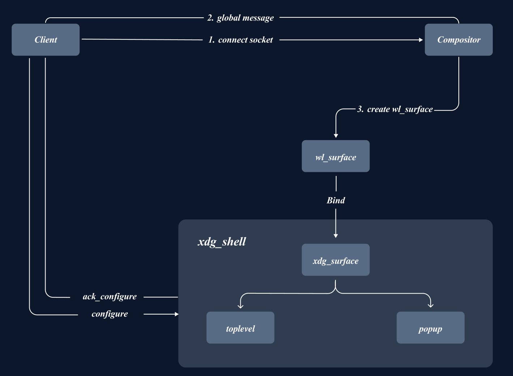
    <p style="font-size:14px;">Figure 3.2 xdg-shell 协议演示图</p>
</div>

##### configure / ack 机制

在 `xdg-shell` 协议中，一个非常重要的机制就是「双向确认机制」：

在有修改需求的时候，`compositor` 发起 `configure` 事件，告知客户端窗口大小、状态变更请求，客户端必须回应 `ack_configure`，明确表示接收到该配置并将进行重绘，只有在 `ack` 后，客户端提交的 `surface.commit()` 内容才会被正式展示。

这种机制是 `Wayland` 相对于传统 `X11` 的一大改进点，确保了服务端与客户端状态始终一致，**不会出现窗口闪动或布局错乱**。

```rust
use smithay::{
    delegate_xdg_shell,
    wayland::shell::xdg::{XdgShellHandler, XdgShellState},
};

// init in state struct
{
    let xdg_shell_state = XdgShellState::new::<Self>(&display_handle);
}

impl XdgShellHandler for State {
    fn xdg_shell_state(&mut self) -> &mut XdgShellState {
        //
    }

    fn new_toplevel(&mut self, surface: ToplevelSurface) {
        //
    }

    fn new_popup(&mut self, surface: PopupSurface, _positioner: PositionerState) {
        //
    }

    fn reposition_request(
        &mut self,
        surface: PopupSurface,
        positioner: PositionerState,
        token: u32,
    ) {
        //
    }

    fn toplevel_destroyed(&mut self, surface: ToplevelSurface) {
        //
    }

    fn move_request(&mut self, surface: ToplevelSurface, seat: wl_seat::WlSeat, serial: Serial) {
        //
    }

    fn resize_request(
        &mut self,
        surface: ToplevelSurface,
        seat: wl_seat::WlSeat,
        serial: Serial,
        edges: xdg_toplevel::ResizeEdge,
    ) {
        //
    }

    fn grab(&mut self, _surface: PopupSurface, _seat: wl_seat::WlSeat, _serial: Serial) { }
}
delegate_xdg_shell!(State);
```

设置 `xdg-shell` 协议的相关代码也非常简单，只需要使用 `smithay` 提供的框架即可。具体函数内部实现的方法，参考基础框架代码。

至此，我们已经完成了核心的 `surface` 分配机制，相当于给画家提供了画板，还设置了画板最后展出的场馆 - `toplevel` 或 `popup` 。

#### 4️⃣ input 事件源

`compositor` 的核心职责之一是处理来自用户的输入事件，如鼠标移动、按键、触摸交互等。而这些输入事件的来源方式依赖于 `compositor` 所使用的后端类型。`Smithay` 提供了多个后端支持，其中包括：

- `winit` 后端：通常用于开发阶段，快速接入图形窗口系统并获取输入；
- `TTY` + `libinput` 后端：更贴近生产环境，直接从内核设备文件读取输入事件，适用于 DRM/KMS 渲染路径。

##### 使用 winit 后端的 input 事件源

在 `winit` 模式下，`Smithay` 提供了高度集成的 `WinitInputBackend` 类型，开发者可以非常方便地将其作为事件源插入 `EventLoop` 中，例如：

```rust
event_loop
    .handle()
    .insert_source(winit_backend, move |event, _, state| {
        state.process_input_event(event);
    })?;
```

`winit` 后端封装了窗口事件与输入事件，并提供统一的接口输出 `InputEvent`。`Smithay` 内部支持对这些事件进行标准化转换，如：

- `PointerEvent`
- `KeyboardEvent`
- `TouchEvent`

通常在 `state.process_input_event` 函数中进行分发，`Smithay` 的 `seat` 抽象会帮助我们自动处理焦点跟踪、输入分发、键盘修饰等细节。

```rust
use smithay::backend::{delegate_seat, input::{Seat, SeatHandler, SeatState}};

// init in state struct
{
    let mut seat_state = SeatState::new();
    let seat_name = String::from("winit");
    let mut seat: Seat<Self> = seat_state.new_wl_seat(display_handle,seat_name);
}

impl SeatHandler for State {
    type KeyboardFocus = WlSurface;
    type PointerFocus = WlSurface;
    type TouchFocus = WlSurface;

    fn seat_state(&mut self) -> &mut SeatState<State> {
        //
    }

    fn cursor_image(
        &mut self,
        _seat: &Seat<Self>,
        image: smithay::input::pointer::CursorImageStatus,
    ) {
        //
    }

    fn focus_changed(&mut self, seat: &Seat<Self>, focused: Option<&WlSurface>) {
        //
    }
}
delegate_seat(State);
```

##### 使用 TTY 后端的 input 事件源

在没有图形服务器支持的**裸机环境**下，我们通常使用 `TTY` 作为图形输出后端，并结合 `libinput` 获取来自 `/dev/input` 的事件。此时输入处理方式较为底层，需要我们显式构造事件源：

```rust
let libinput_context = Libinput::new_with_udev(...);
let input_backend = LibinputInputBackend::new(libinput_context, seat, ...);
```

与 `winit` 不同，`libinput` 后端需要手动处理权限和 `seat` 初始化，但优点在于：

- 支持更精细的输入设备管理；
- 能兼容热插拔、多用户、多 `seat`；
- 更贴近真实硬件行为（如 VT 切换、KMS 挂载）；

事件注册仍然可以通过 `insert_source` 完成。

```rust
event_loop
    .handle()
    .insert_source(input_backend, move |event, _, state| {
        state.process_input_event(event);
    })?;
```

无论是 `winit` 还是 `TTY` 模式，输入事件的处理流程基本保持一致：

- 后端产生 `InputEvent`；
- 事件被传入 `compositor` 的状态处理器；
- `Smithay` 的 `Seat` 接口会自动更新焦点状态、生成 `Wayland` 协议事件；
- 若存在活跃客户端，事件会通过 `wl_pointer`、`wl_keyboard`、`wl_touch` 等接口传输至客户端。

具体的状态如： `InputEvent::Keyboard`，`InputEvent::PointerMotion` 等这里不再详细讲解，具体参考基础框架代码内容。

至此，我们就得到了一个简单的，可以响应客户端请求，并且支持鼠标，键盘操作的简易 Wayland Compositor。

### 3.3 键盘输入快捷键匹配

在 `Mondrain` 中，我们实现了一个轻量且可扩展的全局快捷键匹配系统，用于：

- 启动应用程序（如打开终端）

- 执行窗口管理指令（如聚焦切换、窗口平铺方向调整）

- 支持用户自定义的命令绑定

#### 1️⃣ 快捷键的输入流程概览

- Wayland 中键盘事件由 `wl_keyboard`（或 `xkb`）协议触发，最终通过 `InputManager` 处理。

- 快捷键响应链：  
  `键盘事件 → 按键状态判定（按下/释放） → 匹配组合键 → 执行对应指令`

#### 2️⃣ 正则匹配：解析指令或快捷命令

用户定义的快捷指令存储在 /keybindings.conf 文件中，例如：

```json
# /keybindings.conf
bind = Super_L+f, command, "firefox"
bind = Super_L+1, exec, "workspace-1"
```

为了支持复杂的指令格式，我们在命令解析阶段引入了 Rust 的 `regex` 正则库：

```rust
let re =
    // bind = Ctrl + t, command, "kitty"
    // bind = Ctrl + 1, exec, "func1"
    Regex::new(r#"(?m)^\s*bind\s*=\s*([^,]+?),\s*(command|exec),\s*"([^"]+)"(?:\s*#.*)?$"#)
        .unwrap();

for cap in re.captures_iter(&content) {
    let keybind = &cap[1]; // Ctrl+t / Alt+Enter
    let action = &cap[2]; // exec / command
    let command = &cap[3]; // kitty / rofi -show drun
    ...
}
```

对于解析指令与快捷命令，我们使用 `KeyAction` 存储命令内容，对于解析指令，另外使用 `FunctionEnum` 进行存储，方便后续使用：

```rust
#[derive(Debug)]
pub enum FunctionEnum {
    SwitchWorkspace1,
    SwitchWorkspace2,
    InvertWindow,
    Expansion,
    Recover,
    Quit,
    Kill,
    Json,
    Up(Direction),
    Down(Direction),
    Left(Direction),
    Right(Direction),
}

#[derive(Debug)]
pub enum KeyAction {
    Command(String, Vec<String>),
    Internal(FunctionEnum),
}
```

完整的快捷键识别与匹配，对于 Ctrl Shift 等键，将其设置为左右两键均可触发，保证后续识别执行正确：

```rust
impl InputManager{
    fn load_keybindings(path: &str) -> anyhow::Result<HashMap<String, KeyAction>> {
        let content = fs::read_to_string(path).anyhow_err("Failed to load keybindings config")?;
        let mut bindings = HashMap::<String, KeyAction>::new();

        let re =
            // bind = Ctrl + t, command, "kitty"
            // bind = Ctrl + 1, exec, "func1"
            Regex::new(r#"(?m)^\s*bind\s*=\s*([^,]+?),\s*(command|exec),\s*"([^"]+)"(?:\s*#.*)?$"#)
                .unwrap();

        let modifier_map: HashMap<&str, Vec<&str>> = [
            ("Ctrl", vec!["Control_L", "Control_R"]),
            ("Shift", vec!["Shift_L", "Shift_R"]),
            ("Alt", vec!["Alt_L", "Alt_R"]),
            ("Esc", vec!["Escape"]),
            ("[", vec!["bracketleft"]),
            ("]", vec!["bracketright"]),
            (",", vec!["comma"]),
            (".", vec!["period"]),
            ("/", vec!["slash"]),
            (";", vec!["semicolon"]),
            (".", vec!["period"]),
            ("'", vec!["apostrophe"]),
        ]
        .into_iter()
        .collect();

        for cap in re.captures_iter(&content) {
            let keybind = &cap[1]; // Ctrl+t / Alt+Enter
            let action = &cap[2]; // exec / command
            let command = &cap[3]; // kitty / rofi -show drun

            let keys: Vec<String> = keybind
                .split('+')
                .map(|key| {
                    if let Some(modifiers) = modifier_map.get(key) {
                        modifiers.iter().map(|m| m.to_string()).collect()
                    } else {
                        vec![key.to_string()]
                    }
                })
                .multi_cartesian_product()
                .map(|combination| combination.join("+"))
                .collect();

            for key in keys {
                let action_enum = match action {
                    "command" => {
                        let mut parts = command.split_whitespace();
                        let cmd = parts.next().unwrap_or("").to_string();
                        let args: Vec<String> = parts.map(|s| s.to_string()).collect();

                        KeyAction::Command(cmd, args)
                    }
                    "exec" => {
                        let internal_action = match command.trim() {
                            "workspace-1" => FunctionEnum::SwitchWorkspace1,
                            "workspace-2" => FunctionEnum::SwitchWorkspace2,
                            "invert" => FunctionEnum::InvertWindow,
                            "recover" => FunctionEnum::Recover,
                            "expansion" => FunctionEnum::Expansion,
                            "quit" => FunctionEnum::Quit,
                            "kill" => FunctionEnum::Kill,
                            "json" => FunctionEnum::Json,
                            "up" => FunctionEnum::Up(Direction::Up),
                            "down" => FunctionEnum::Down(Direction::Down),
                            "left" => FunctionEnum::Left(Direction::Left),
                            "right" => FunctionEnum::Right(Direction::Right),
                            _ => {
                                tracing::info!(
                                    "Warning: No registered function for exec '{}'",
                                    command
                                );
                                continue;
                            }
                        };
                        KeyAction::Internal(internal_action)
                    }
                    _ => continue,
                };

                bindings.insert(key.to_string(), action_enum);
            }
        }

        #[cfg(feature = "trace_input")]
        for (key, action) in &bindings {
            tracing::info!(%key, action = ?action, "Keybinding registered");
        }

        Ok(bindings)
    }
}
```

#### 3️⃣ Keymap 映射：输入事件的键码与组合键识别

使用 `xkbcommon` 配合 `Smithay::input`，可以将原始键码解析为用户理解的键位，如：

- 原始：`keycode = 38`（硬件码）

- 解析后：`keysym = "a"`

一般快捷键均由功能键发起，为了确保识别正确，我们定义了一个优先级 map，用于设置功能键优先于所有字母键。

```rust
...
// priority: Ctrl > Shift > Alt
let priority_map: HashMap<String, i32> = [
    ("Super_L", 0),
    ("Control_L", 1),
    ("Control_R", 1),
    ("Shift_L", 2),
    ("Shift_R", 2),
    ("Alt_L", 3),
    ("Alt_R", 3),
]
.into_iter()
.map(|(k, v)| (k.to_string(), v))
.collect();
...
```

在按下某个按键时，通过 `keysym_get_name()` 得到硬件码对应的可读 ASCII 码，并且将其按照优先级排序后，排列成当前按下键，交与 `action_keys()` 函数处理快捷键事件。

```rust
...
KeyState::Pressed => {
    let mut pressed_keys_name: Vec<String> =
        keyboard.with_pressed_keysyms(|keysym_handles| {
            keysym_handles
                .iter()
                .map(|keysym_handle| {
                    let keysym_value = keysym_handle.modified_sym();
                    let name = keysym_get_name(keysym_value);
                    if name == "Control_L" {
                        #[cfg(feature = "trace_input")]
                        info!("mainmod_pressed: true");
                        data.input_manager.set_mainmode(true);
                    }
                    name
                })
                .collect()
        });
    pressed_keys_name
        .sort_by_key(|key| priority_map.get(key).cloned().unwrap_or(3));
    let keys = pressed_keys_name.join("+");
    #[cfg(feature = "trace_input")]
    info!("Keys: {:?}", keys);
    data.action_keys(keys, serial);
}
...
...
pub fn action_keys(&mut self, keys: String, serial: Serial) {
    let keybindings = self.input_manager.get_keybindings();
    if let Some(command) = keybindings.get(&keys) {
        match command {
            KeyAction::Command(cmd, args) => {
                #[cfg(feature = "trace_input")]
                info!("Command: {} {}", cmd, args.join(" "));
                let mut command = std::process::Command::new(cmd);
                for arg in args {
                    command.arg(arg);
                }
                match command.spawn() {
                    #[cfg(feature = "trace_input")]
                    Ok(child) => {
                        info!("Command spawned with PID: {}", child.id());
                    }
                    Err(e) => {
                        error!(
                            "Failed to execute command '{} {}': {}",
                            cmd,
                            args.join(" "),
                            e
                        );
                    }
                    #[cfg(not(feature = "trace_input"))]
                    _ => {}
                }
            }
            KeyAction::Internal(func) => match func {
                FunctionEnum::SwitchWorkspace1 => {
                    self.set_keyboard_focus(None, serial);
                    self.workspace_manager.set_activated(WorkspaceId::new(1));
                }
                ...
            },
        }
    }
}
...
```

### 3.4 tty 裸机直连

项目在裸机终端中自行初始化 DRM/KMS 图形管线，并通过 GBM 和 EGL 建立 GPU 渲染上下文，使用 OpenGL ES 进行硬件加速合成显示。启动后该 Compositor 接管系统图形输出，并成为客户端程序（如终端模拟器、浏览器）的 Wayland 显示服务。

<div style="text-align: center;">
    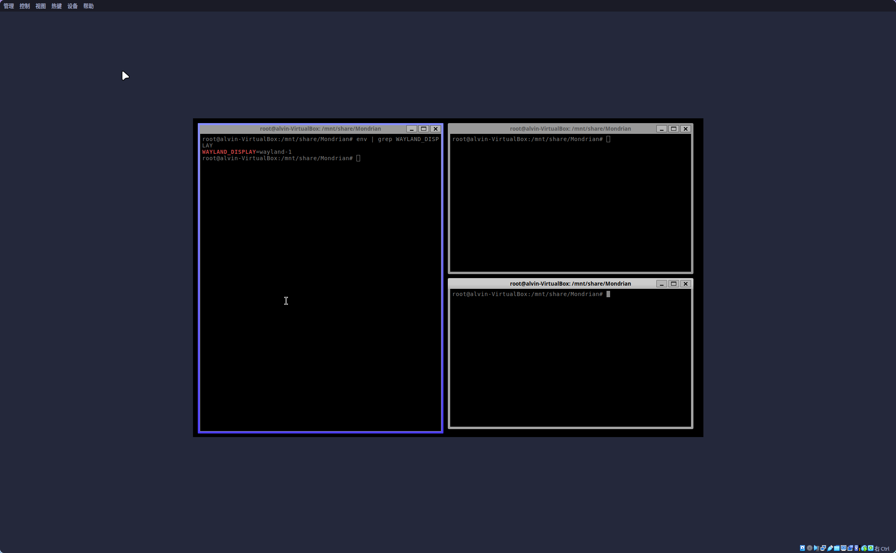
    <p style="font-size:14px;">Figure 3.3 tty 直连演示图</p>
</div>

#### 1️⃣ Linux 图形栈核心技术组件

<div style="text-align: center;">
    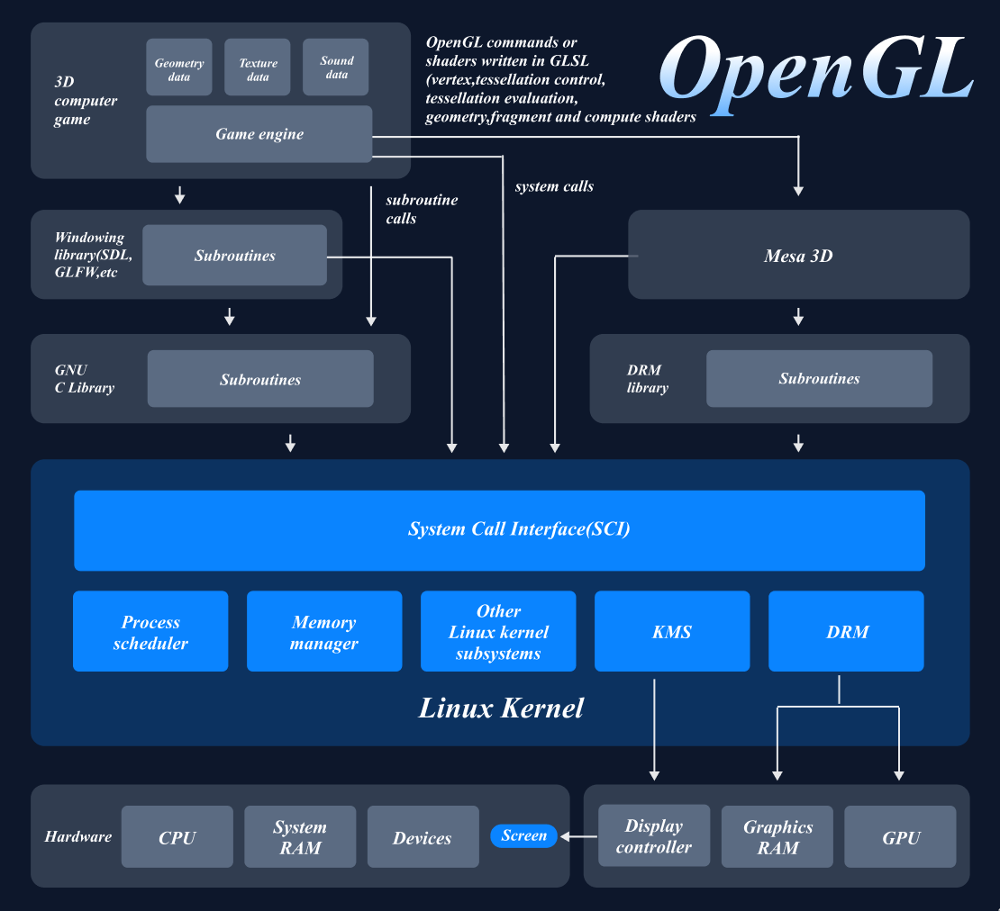
    <p style="font-size:14px;">Figure 3.4 opengl render 演示图</p>
</div>

用画廊来举例，会比较容易理解。

画师就是 OpenGL/GLES，用于绘制用户提交的绘制需求，在绘制之前，画廊陈列员（EGL）
会负责与库存管理员（GBM）联系，确定好最终需要陈放画框的大小（buffer size），位置（egl buffer 映射）以及一些其他内容（egl context）。画师绘制完图画以后，先将图画堆积到队列中（queue frame），时机到达后（VBlank）就将原先墙上的画拿下，然后挂上新的画（page flip）。

下面是正式的介绍。

##### OpenGL/GLES

OpenGL（Open Graphics Library） 与其精简版 OpenGL ES（Embedded Systems） 是广泛使用的跨平台图形渲染 API，用于执行图形计算和渲染操作。在嵌入式或资源受限的环境中，OpenGL ES 更为常用，其接口更加轻量，适合直接在 TTY 裸机模式下运行。

在本项目中，OpenGL ES 被用于执行 GPU 加速的图形渲染任务。具体包括：

- 几何图形的绘制（如窗口、装饰、阴影）；
- 着色器程序的编译与执行；
- 将渲染内容输出到帧缓冲（Framebuffer）中，供后续显示。

在 TTY 裸机模式下，合成器通过 OpenGL ES 执行图形绘制操作，如几何图元绘制、纹理映射和着色器执行，最终将图像渲染到 GPU 管理的缓冲区（Framebuffer）中。

##### EGL

EGL 是连接 OpenGL ES 与本地窗口系统（如 X11、Wayland、或裸设备如 GBM）的中间接口库。其职责包括：

- 初始化图形上下文；
- 创建渲染表面（EGLSurface）；
- 在渲染器与底层硬件（GBM、DRM）之间建立连接；
- 管理 buffer swap（如 eglSwapBuffers()）与同步机制。

在 TTY 环境中，EGL 通常与 GBM 配合使用，将 GPU buffer 分配出来供 OpenGL ES 使用，建立渲染到显示设备之间的桥梁。

##### GBM（Generic Buffer Management）

GBM 是 Mesa 提供的一个用于和内核 DRM 系统交互的库，它的主要功能是：

- 分配可被 GPU 渲染的缓冲区（bo：buffer object）；
- 将这些缓冲区导出为 DMA-BUF handle，用于与 DRM 或其他进程共享；
- 为 EGL 提供可渲染的 EGLNativeWindowType。

GBM 允许在没有窗口系统的场景下（如 TTY 模式）创建 OpenGL 可用的 framebuffer，从而支持嵌入式系统和裸机合成器的图形输出。

##### Mesa3D

Mesa3D 是开源图形栈的核心，提供了 OpenGL、OpenGL ES、EGL、GBM 等多个图形接口的完整实现。它在用户空间运行，并与内核空间的 DRM 驱动协同工作。

Mesa 提供以下功能：

- 实现 OpenGL / GLES API，并将其转译为 GPU 硬件可识别的命令；
- 管理 shader 编译、状态机、纹理、缓冲区等所有渲染细节；
- 实现 GBM 与 DRM 的绑定，支持 buffer 分配与传输；
- 调度 page flip 请求，通过 DRM 与显示硬件同步。

##### DRM（Direct Rendering Manager）

***直接渲染管理器***（Direct Rendering Manager，缩写为 DRM）是 Linux 内核图形子系统的一部分，负责与 GPU（图形处理单元）通信。它允许用户空间程序（如图形服务器或 Wayland compositor）通过内核公开的接口，完成以下关键任务：

- 分配和管理图形缓冲区（buffer）
- 设置显示模式（分辨率、刷新率等）
- 与显示设备（显示器）建立连接
- 将 GPU 渲染结果显示到屏幕上 - PageFlip 页面翻转

DRM 是现代 Linux 图形栈的基础，允许程序绕过传统 X Server，直接操作 GPU，形成了“GPU 直连”的渲染路径。

<div style="text-align: center;">
    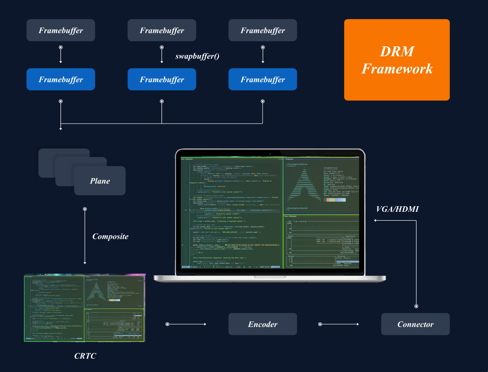
    <p style="font-size:14px;">Figure 3.5 DRM 演示图</p>
</div>

要想理解 DRM ，首先要理解两个关键子模块的工作内容：

###### GEM（Graphic Execution Manager）

***图形执行管理器***（Graphics Execution Manager，简称 GEM）是 DRM 子系统中的另一个重要模块，主要用于内存管理，即如何分配和管理 GPU 可访问的图形缓冲区（buffer）。

它提供了如下功能：

- 为用户空间分配 GPU 使用的显存或系统内存缓冲区
- 提供缓冲区在用户空间与内核空间之间的共享与引用机制
- 管理缓冲区的生命周期和同步（避免读写冲突）

帧缓冲区对象（framebuffer）是帧内存对象的抽象，它提供了像素源给到 CRTC。帧缓冲区依赖于底层内存管理器分配内存。

在程序中，使用 DRM 接口创建 framebuffer、EGL 创建的渲染目标，底层通常都通过 GEM 管理。GEM 的存在使得多种图形 API（OpenGL ES、Vulkan、视频解码等）可以统一、高效地访问 GPU 资源。

###### KMS（Kernel Mode Setting）

***内核模式设置***（Kernel Mode Setting，简称 KMS）是 DRM 的子系统，用于控制显示设备的“输出路径”，即显示管线。它允许在内核空间完成分辨率设置、刷新率调整、帧缓冲切换等操作，而不依赖用户空间的图形服务器。

KMS 将整个显示控制器的显示 pipeline 抽象成以下几个部分：

- Plane（图层）
  
  每个 plane 表示一块可渲染的图像区域，可独立组合显示输出。plane 分为三类：
  
  - Primary：主图层，必需。对应于整个屏幕内容，通常显示整个帧缓冲区。
  - Cursor：用于显示鼠标光标，通常是一个小图层，支持硬件加速。
  - Overlay：可选的叠加图层，用于视频加速或硬件合成。

- CRTC（Cathode Ray Tube Controller）
  
  控制图像从 plane 传送到 encoder，类似一个“图像流控制器”，主要用于管理显示设备的扫描和刷新。一个 CRTC 通常绑定一个主 plane，但也可能支持多个 overlay。

- Encoder（编码器）
  
  将图像信号从 GPU 转换为特定格式，如 HDMI、DP、eDP、VGA 等。

- Connector（连接器）
  
  表示实际的物理接口（如 HDMI 接口、DisplayPort 接口），对应连接的显示设备（monitor）。

> 🔄 工作流程示意：Plane → CRTC → Encoder → Connector → 屏幕

##### libinput/evdev

evdev（Event Device） 是 Linux 内核提供的一个通用输入事件接口，所有输入设备（键盘、鼠标、触控板、游戏手柄等）在内核中都会以 /dev/input/eventX 设备节点的形式暴露，用户空间可以通过这些节点读取输入事件（如按键、移动、点击等）。

然而，直接与 evdev 接口打交道较为繁琐、底层，且各类设备的事件语义不尽相同。因此，在现代图形系统中，通常借助 libinput 作为更高级的输入事件处理库。

libinput 是一个*用户空间库*，提供统一的输入设备管理接口，具备以下功能：

- 统一处理来自 evdev 的事件流；
- 解析输入事件，生成高级抽象（如双指滚动、滑动、手势等）；
- 管理输入设备的生命周期（添加、移除）；
- 提供输入设备的识别信息（厂商、型号、功能等）；
- 与 Wayland compositor 无缝集成，支持多种后端（如 udev、seatd）。

#### 2️⃣ Wayland 通信流程与显示流程

本项目实现了一个独立于 X11、无需任何桌面环境即可运行的 Wayland 合成器（compositor），通过直接接管 TTY 并使用 DRM/KMS 完成图形显示。在显示系统的构建中，Wayland 扮演的是 图形系统通信协议 的角色，而具体的渲染、显示和输入处理由 DRM、GBM、EGL 与 libinput 等模块协同完成。

Wayland 合成器的主要职责是：

- 接受客户端（Wayland client）的连接与绘图请求
- 将客户端 buffer 进行合成、渲染并显示在屏幕上
- 处理来自内核的输入事件

```
[Wayland Client]
    ↓ 提交 buffer（wl_buffer / linux-dmabuf）
[Compositor]
    ↓ OpenGL 合成（将多个窗口 buffer 组合）
[Framebuffer]
    ↓ DRM 显示 pipeline（crtc → encoder → connector）
[Monitor Output]
```

##### 通信流程概述

###### 客户端连接与交互

每个 Wayland 客户端通过 Socket 与合成器通信，注册所需协议（如 wl_surface, xdg_surface），并通过共享内存或 GPU buffer 提交其绘制内容。

###### Buffer 获取与提交

客户端通过 wl_buffer 协议提供绘制完成的内容。这个 buffer 可能来自：

- wl_shm：CPU 绘制后的共享内存（较慢）
- linux-dmabuf：GPU 渲染结果，零拷贝

###### 合成器接管 buffer 并合成

合成器在服务端接收 attach / commit 请求后，将客户端的 buffer 记录为当前帧的一部分。在下一帧刷新中，所有窗口的 buffer 会被 GPU 合成到一个输出 surface 上。

###### GPU 渲染与提交

使用 OpenGL ES 渲染这些 buffer（如绘制窗口、阴影、边框等），再通过 eglSwapBuffers 提交帧缓冲，交由 DRM 显示。

###### Page Flip 显示与 VBlank 同步

合成后的 framebuffer 通过 drmModePageFlip 提交，等待垂直同步（VBlank）时切换至新帧，防止 tearing。

##### 输入事件处理流程

合成器使用 libinput 接管来自内核的输入事件（通过 evdev 设备），包括：

- 键盘事件（按键、组合键）
- 鼠标移动 / 点击 / 滚动
- 触控板 / 手势识别（如双指缩放、滑动）

输入事件首先由 Compositor 进行解析，无需响应时间时，发送给对应拥有 keyboard, pointer, touch focus 的客户端，通过协议如 wl_pointer.motion, wl_keyboard.key, wl_touch.down 等完成回传。

#### 3️⃣ 代码实现细节

Tty 后端部分代码量过大，这里只解释核心的代码部分。

基本数据结构：

```rust
pub struct Tty {
    pub session: LibSeatSession,
    pub libinput: Libinput,
    pub gpu_manager: GpuManager<GbmGlesBackend<GlesRenderer, DrmDeviceFd>>,
    pub primary_node: DrmNode,
    pub primary_render_node: DrmNode,
    pub devices: HashMap<DrmNode, OutputDevice>,
    pub seat_name: String,
    pub dmabuf_global: Option<DmabufGlobal>,
}

pub struct OutputDevice {
    token: RegistrationToken,
    render_node: DrmNode,
    drm_scanner: DrmScanner,
    surfaces: HashMap<crtc::Handle, Surface>,
    #[allow(dead_code)]
    active_leases: Vec<DrmLease>,
    drm: DrmDevice,
    gbm: GbmDevice<DrmDeviceFd>,

    // record non_desktop connectors such as VR headsets
    // we need to handle them differently
    non_desktop_connectors: HashSet<(connector::Handle, crtc::Handle)>,
}

pub struct Surface {
    output: Output,
    #[allow(dead_code)]
    device_id: DrmNode,
    render_node: DrmNode,
    compositor: GbmDrmCompositor,
    dmabuf_feedback: Option<SurfaceDmabufFeedback>,
}
```

这里主要维护三个数据结构，Tty 为总后端，其持有多个 OutputDevice，也就是 GPU 设备，每个 GPU 设备可能会持有多个 Surface，对应的是显示器。

Tty 中还获取记录主 GPU 节点与其渲染节点，输入设备管理器名称等

```rust
impl Tty {
    pub fn new(loop_handle: &LoopHandle<'_, GlobalData>) -> anyhow::Result<Self> {
        // Initialize session
        let (session, notifier) = LibSeatSession::new()?;
        let seat_name = session.seat();

        let mut libinput = Libinput::new_with_udev::<LibinputSessionInterface<LibSeatSession>>(
            session.clone().into(),
        );
        libinput.udev_assign_seat(&seat_name).unwrap();
        let libinput_backend = LibinputInputBackend::new(libinput.clone());

        loop_handle
            .insert_source(libinput_backend, |mut event, _, data| {
                if let InputEvent::DeviceAdded { device } = &mut event {
                    info!("libinput Device added: {:?}", device);
                    if device.has_capability(DeviceCapability::Keyboard) {
                        if let Some(led_state) = data.input_manager.seat.get_keyboard().map(|keyboard| {
                            keyboard.led_state()
                        }) {
                            info!("Setting keyboard led state: {:?}", led_state);
                        }
                    }
                } else if let InputEvent::DeviceRemoved { ref device } = event {
                    info!("libinput Device removed: {:?}", device);
                }
                data.process_input_event(event);
            })
            .unwrap();

        loop_handle
            .insert_source(notifier, move |event, _, data| match event {
                SessionEvent::ActivateSession => {
                    info!("Session activated");
                    if data.backend.tty().libinput.resume().is_err() {
                        warn!("error resuming libinput session");
                    };

                }
                SessionEvent::PauseSession => {
                    info!("Session paused");
                    data.backend.tty().libinput.suspend();
                    for device in data.backend.tty().devices.values_mut() {
                        device.drm.pause();
                    }
                }
            })
            .unwrap();

        // Initialize Gpu manager
        let api = GbmGlesBackend::with_context_priority(ContextPriority::Medium);
        let gpu_manager = GpuManager::new(api).context("error creating the GPU manager")?;

        let primary_gpu_path = udev::primary_gpu(&seat_name)
            .context("error getting the primary GPU")?
            .context("couldn't find a GPU")?;

        info!("using as the primary node: {:?}", primary_gpu_path);

        let primary_node = DrmNode::from_path(primary_gpu_path)
            .context("error opening the primary GPU DRM node")?;

        info!("Primary GPU: {:?}", primary_node);

        // get render node if exit - /renderD128
        let primary_render_node = primary_node
            .node_with_type(NodeType::Render)
            .and_then(Result::ok)
            .unwrap_or_else(|| {
                warn!("error getting the render node for the primary GPU; proceeding anyway");
                primary_node
            });

        let primary_render_node_path = if let Some(path) = primary_render_node.dev_path() {
            format!("{:?}", path)
        } else {
            format!("{}", primary_render_node)
        };
        info!("using as the render node: {}", primary_render_node_path);

        Ok(Self {
            session,
            libinput,
            gpu_manager,
            primary_node,
            primary_render_node,
            devices: HashMap::new(),
            seat_name,
            dmabuf_global: None,
        })
    }
}
```

`Tty::new()` 主要做了以下几件事：

- 监听 libinput 输入事件
- 监听 session 事件
- 初始化 gbm，获取主 GPU 信息

```rust
impl Tty{
    pub fn init(
        &mut self,
        loop_handle: &LoopHandle<'_, GlobalData>,
        display_handle: &DisplayHandle,
        output_manager: &mut OutputManager,
        render_manager: &RenderManager,
        state: &mut State,
    ) {
        let udev_backend = UdevBackend::new(&self.seat_name).unwrap();

        // gpu device
        for (device_id, path) in udev_backend.device_list() {
            if let Ok(node) = DrmNode::from_dev_id(device_id) {
                if let Err(err) = self.device_added(
                    loop_handle,
                    display_handle,
                    node, 
                    &path, 
                    output_manager, 
                    render_manager,
                    state,
                ) {
                    warn!("erro adding device: {:?}", err);
                }
            }
        }

        let mut renderer = self.gpu_manager.single_renderer(&self.primary_render_node).unwrap();

        state.shm_state.update_formats(
            renderer.shm_formats(),
        );

        match renderer.bind_wl_display(display_handle) {
            Ok(_) => info!("EGL hardware-acceleration enabled"),
            Err(err) => info!(?err, "Failed to initialize EGL hardware-acceleration"),
        }

        loop_handle
            .insert_source(udev_backend, move |event, _, data| match event {
                UdevEvent::Added { device_id, path } => {
                    if let Ok(node) = DrmNode::from_dev_id(device_id) {
                        if let Err(err) = data.backend.tty().device_added(
                            &data.loop_handle,
                            &data.display_handle,
                            node,
                            &path,
                            &mut data.output_manager,
                            &data.render_manager,
                            &mut data.state,
                        ) {
                            warn!("erro adding device: {:?}", err);
                        }
                    }
                }
                UdevEvent::Changed { device_id } => {
                    if let Ok(node) = DrmNode::from_dev_id(device_id) {
                        data.backend.tty().device_changed(
                            node,
                            &mut data.output_manager,
                            &data.display_handle,
                        )
                    }
                }
                UdevEvent::Removed { device_id } => {
                    if let Ok(node) = DrmNode::from_dev_id(device_id) {
                        data.backend.tty().device_removed(
                            &data.loop_handle,
                            &data.display_handle,
                            node, 
                            &mut data.output_manager,
                            &mut data.state,
                        );
                    }
                }
            })
            .unwrap();

        loop_handle.insert_idle(move |data| {
            info!(
                "The tty render start at: {:?}",
                data.clock.now().as_millis()
            );
            // TODO: use true frame rate
            let duration = Duration::from_millis(1000 / 100);
            let next_frame_target = data.clock.now() + duration;
            let timer = Timer::from_duration(duration);
            data.next_frame_target = next_frame_target;

            data.loop_handle
                .insert_source(timer, move |_, _, data| {
                    // info!(
                    //     "render event, time: {:?}, next_frame_target: {:?}",
                    //     data.clock.now().as_millis(),
                    //     data.next_frame_target.as_millis()
                    // );
                    if data.clock.now() > data.next_frame_target + MINIMIZE {
                        // drop current frame, render next frame
                        info!("jump the frame");
                        data.next_frame_target = data.next_frame_target + duration;
                        let new_duration = Duration::from(data.next_frame_target)
                            .saturating_sub(data.clock.now().into());
                        return TimeoutAction::ToDuration(new_duration);
                    }

                    data.backend.tty().render_output(
                        &mut data.render_manager,
                        &data.output_manager,
                        &data.workspace_manager,
                        &mut data.cursor_manager,
                        &data.input_manager,
                    );

                    // For each of the windows send the frame callbacks to tell them to draw next frame.
                    data.workspace_manager.elements().for_each(|window| {
                        window.send_frame(
                            data.output_manager.current_output(),
                            data.start_time.elapsed(),
                            Some(Duration::ZERO),
                            |_, _| Some(data.output_manager.current_output().clone()),
                        )
                    });

                    data.workspace_manager.refresh();
                    data.popups.cleanup();
                    data.display_handle.flush_clients().unwrap();

                    data.next_frame_target = data.next_frame_target + duration;
                    let new_duration = Duration::from(data.next_frame_target)
                        .saturating_sub(data.clock.now().into());

                    TimeoutAction::ToDuration(new_duration)
                })
                .unwrap();

            data.backend.tty().render_output(
                &mut data.render_manager,
                &data.output_manager,
                &data.workspace_manager,
                &mut data.cursor_manager,
                &data.input_manager,
            );
        });
    }
}
```

`Tty::init()` 主要完成以下几件事：

- 监听 udev，获取所有 GPU 设备以及其对应的显示器信息
- 按照给定帧率执行渲染流程

本项目目前只实现了单 GPU 单显示器固定帧率渲染，渲染部分主要按照此流程重复执行：

```
render_output() // 渲染指定显示器上的内容
↓
queue_frame() // 将渲染好的内容送至等待队列，等待 pageflip
↓
VBlank // 垂直同步信号
↓
frame_submmit() // 提交帧，执行 pageflip
```

### 3.5 平铺式布局算法

在一个窗口管理器中，布局系统扮演着核心角色。为了高效管理窗口的空间排布，本项目采用了一种结构清晰、修改高效的 ***容器式二叉树（Contain Binary Tree）*** 结构作为窗口布局的基础数据模型。该树结构基于 `SlotMap` 构建，结合唯一键值索引（Key-based access），理论上可以将常规操作如插入、删除、定位的时间复杂度优化至常数级别 `O(1)`，由于窗口数量一般不超过两位数，本项目综合考量时间与空间复杂度，最终实现 `O(n)` 时间复杂度。

由于二叉树的方向表达能力不足，本项目还引入了 ***全局窗口邻接表*** 作为补充描述数据结构，记录全局所有窗口的临接方向关系。

为了管理和组织当前活动窗口的空间结构，在 `Workspace` 结构体中维护了两个核心字段：

```rust
#[derive(Debug)]
pub struct Workspace {
    ...
    pub scheme: TiledScheme,
    pub tiled_tree: Option<TiledTree>,
}
```

- `scheme`：用于指示当前使用的窗口排列方案。
- `tiled_tree`：存储当前工作区内窗口的具体排布信息，其核心数据结构即为 `TiledTree`。

#### 1️⃣ 数据结构设计

##### 布局方案枚举

为布局方案定义枚举类型，默认跟随鼠标焦点布局方案。

```rust
#[derive(Debug, Clone)]
pub enum TiledScheme {
    Default,
    Spiral,
}
```

##### 节点信息设计

```rust
pub enum Direction {
    Left,
    Up,
    Right,
    Down,
}

pub enum NodeData {
    Leaf { window: Window },
    Split {
        direction: Direction,
        rec: Rectangle<i32, Logical>,
        offset: Point<i32, Logical>,
        left: NodeId,
        right: NodeId,
    }
}
```

- **内部节点（父节点）**：代表一个区域被划分的逻辑，存储以下信息：
  
  - 分裂方向：上下左右，当窗口新建时，方向被插入窗口的相对位置
  - 窗口的起点位置与总大小
  - 子节点的索引（左子节点与右子节点）
  - offset：内部分裂的偏差值（用于手动更新窗口大小）

- **叶子节点**：表示一个具体窗口的存在，只存储窗口 ID（或 Surface ID），不再包含其他布局信息。

> 说明：每次添加新窗口时，目标叶子节点会被替换为一个新的父节点，并且规定左子节点处于布局的上方/左侧，其两个子节点分别为原窗口和新窗口的 ID。

##### SlotMap

为提升树结构的动态操作性能，本项目引入了 [Rust 的 SlotMap](https://docs.rs/slotmap/) 作为节点存储的底层容器。相比传统引用或 `Box` 指针，`SlotMap` 具有以下优势：

- **快速访问**：所有节点通过唯一的 Key 标识，可在 O(1) 时间内访问。
- **插入与删除开销小**：不影响其他节点位置，避免指针更新或数据重排。
- **避免悬垂指针问题**：因为节点通过 key 而非裸指针引用，内存安全性更高。

每个节点在 `SlotMap` 中都会分配一个唯一的 `NodeId`，父节点只需保存左右子节点的 `NodeId`，大大简化了树的管理和操作逻辑。

以下是 `TiledTree` 的基础定义：

```rust
use slotmap::{new_key_type, SlotMap};

new_key_type! {
    pub struct NodeId;
}

#[derive(Debug)]
pub struct TiledTree {
    nodes: SlotMap<NodeId, NodeData>,
    spiral_node: Option<NodeId>,
    root: Option<NodeId>,
    neighbor_graph: NeighborGraph,

    gap: i32,
}
```

在这个结构中：

- `nodes`：维护了整个布局树中所有节点的数据。
- `root`：指向当前布局树的根节点，如果树为空，则为 `None`。
- `spiral_node`：与螺旋布局有关，记录螺旋部剧的尾部。
- `neighbor_graph`：全局邻接表。
- `gap`：样式设置信息，窗口间距。

<div style="text-align: center;">
    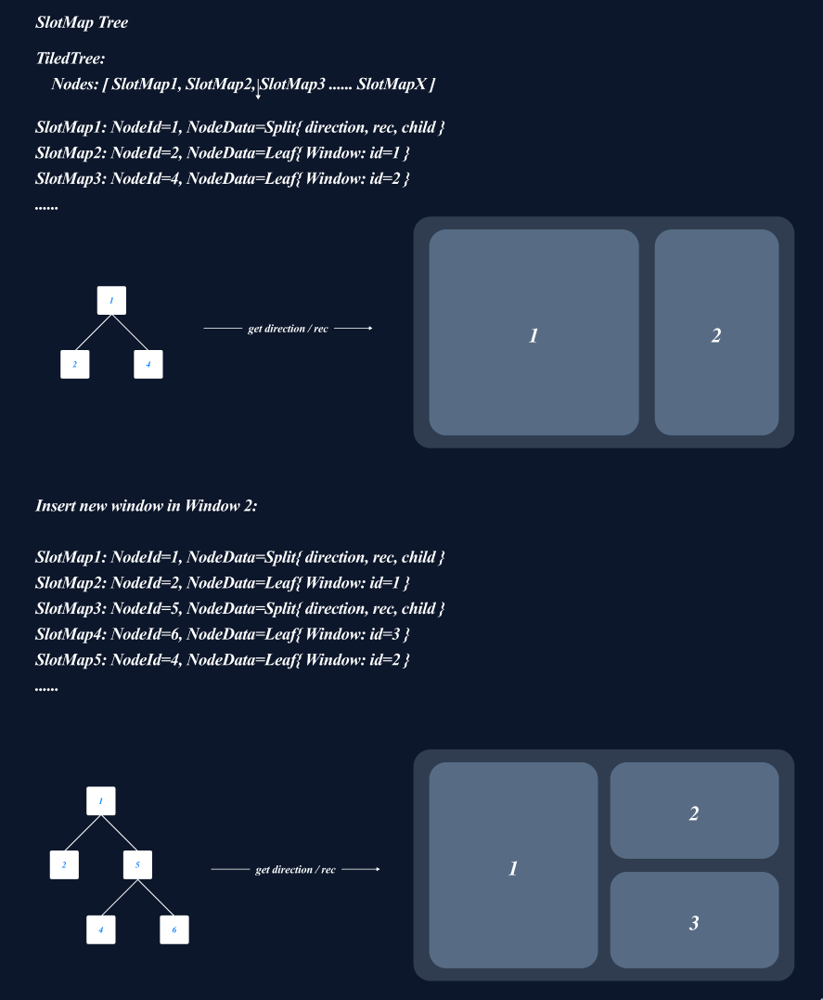
    <p style="font-size:14px;">Figure 3.6 slotmap</p>
</div>

以下是创建树与一些必要的工具函数：

```rust
impl TiledTree {
    pub fn new(window: Window, gap: i32) -> Self {
        let mut nodes = SlotMap::with_key();
        let root = Some(nodes.insert(NodeData::Leaf { window }));
        let spiral_node = root.clone();

        Self { 
            nodes,
            spiral_node,
            root,
            neighbor_graph: NeighborGraph::new(),

            gap,
       }
    }

    pub fn is_empty(&self) -> bool {
        self.root.is_none()
    }

    pub fn find_node(&self, window: &Window) -> Option<NodeId> {
        self.nodes.iter()
            .find_map(|(id, data)| match data {
                NodeData::Leaf { window: w } if w == window => Some(id),
                _ => None,
            })
    }    

        pub fn modify(&mut self, node_id: NodeId, rec: Rectangle<i32, Logical>, space: &mut Space<Window>, loop_handle: &LoopHandle<'_, GlobalData>) {
        // modify the child tree with new rec with direction
        match &mut self.nodes[node_id] {
            NodeData::Leaf { window } => {
                let from = space.element_geometry(&window).unwrap();

                window.set_rec(rec.size);
                space.map_element(window.clone(), rec.loc, false);

                let window = window.clone();
                loop_handle.insert_idle(move |data| {
                    data.render_manager.add_animation(
                        window,
                        from,
                        rec,
                        Duration::from_millis(30),
                        crate::animation::AnimationType::EaseInOutQuad,
                    );
                });
            },
            NodeData::Split { left, right, direction, rec: current_rec, offset } => {
                let (l_rec, r_rec) = recover_new_rec(rec, direction, offset.clone(), self.gap);

                *current_rec = rec.clone();

                let left_id = *left;
                let right_id = *right;

                self.modify(left_id, l_rec, space, loop_handle);
                self.modify(right_id, r_rec, space, loop_handle);
            }
        }
    }

    fn find_parent_and_sibling(&self, target: NodeId) -> Option<(NodeId, NodeId)> {
        self.nodes.iter().find_map(|(id, data)| match data {
            NodeData::Split { left, right, .. } => {
                if *left == target {
                    Some((id, *right))
                } else if *right == target {
                    Some((id, *left))
                } else {
                    None
                }
            }
            _ => None,
        })
    }

    pub fn get_first_window(&self) -> Option<&Window> {
        let root_id = match self.get_root() {
            Some(r) => {
                r
            }
            None => {
                warn!("Failed to get root_id");
                return None
            }
        };

        fn get_window(nodes: &SlotMap<NodeId, NodeData>, id: NodeId) -> Option<&Window> {
            match &nodes[id] {
                NodeData::Leaf { window } => Some(window),
                NodeData::Split { left, .. } => {
                    get_window(nodes, *left)
                }
            }
        }

        get_window(&self.nodes, root_id)
    }

    #[cfg(feature="trace_layout")]
    pub fn print_tree(&self) {
        fn print(nodes: &SlotMap<NodeId, NodeData>, id: NodeId, depth: usize) {
            let indent = "  ".repeat(depth);
            match &nodes[id] {
                NodeData::Leaf { window } => tracing::info!("{indent}- Leaf: {:?}", window.get_id()),
                NodeData::Split { left, right, .. } => {
                    tracing::info!("{indent}- Split:");
                    print(nodes, *left, depth + 1);
                    print(nodes, *right, depth + 1);
                }
            }
        }

        print(&self.nodes, self.root.unwrap(), 0);
    }
}
```

##### 全局窗口邻接表

`全局窗口邻接表` 用于记录所有窗口与邻居窗口之间的位置关系，表示为 A direction B，使用 `HashMap` 进行维护。

```rust
#[derive(Debug, Clone)]
pub struct NeighborGraph {
    edges: HashMap<Window, HashMap<Direction, Vec<Window>>>,
}
```

`全局窗口邻接表` 主要完成对新插入窗口，删除窗口，更新窗口后的所有邻接关系的更新与修改。

```rust
impl NeighborGraph {
    pub fn new() -> Self {
        Self {
            edges: HashMap::new()
        }
    }

    pub fn get(&self, window: &Window, direction: &Direction) -> Option<&Vec<Window>> {
        self.edges.get(window)?.get(direction)
    }

    pub fn add_window(&mut self, from: Window, direction: Direction, to: Vec<Window>) {
        self.edges.entry(from).or_default().entry(direction).or_default().extend(to);
    }

    pub fn remove_window(&mut self, from: &Window, direction: Direction, to: &Window) {
        if let Some(dir_map) = self.edges.get_mut(from) {
            if let Some(vec) = dir_map.get_mut(&direction) {
                vec.retain(|win| win != to);
                if vec.is_empty() {
                    dir_map.remove(&direction);
                }
            }
            if dir_map.is_empty() {
                self.edges.remove(from);
            }
        }
    }

    pub fn remove_direction(&mut self, target: &Window, direction: &Direction) -> Option<Vec<Window>> {
        self.edges.get_mut(target)?.remove(direction)
    }

    pub fn tiled_add(&mut self, from: Window, direction: Direction, new: Window) {
        let opposite = direction.opposite();
        let orthogonal = direction.orthogonal();

        // new <--> orthogonal neighbors
        for d in orthogonal {
            if let Some(neighbors_orthogonal) = self.get(&from, &d).cloned() {

                for neighbor in &neighbors_orthogonal {
                    self.add_window(neighbor.clone(), d.opposite(), vec![new.clone()]);
                }

                self.add_window(new.clone(), d.clone(), neighbors_orthogonal);
            }
        }

        // new <--> neighbors
        if let Some(neighbors_direction) = self.remove_direction(&from, &direction) {

            for neighbor in &neighbors_direction {
                self.remove_window(neighbor, opposite.clone(), &from);
                self.add_window(neighbor.clone(), opposite.clone(), vec![new.clone()]);
            }

            self.add_window(new.clone(), direction.clone(), neighbors_direction);
        }

        // new <--> from
        self.add_window(from.clone(), direction, vec![new.clone()]);
        self.add_window(new, opposite, vec![from]);
    }

    pub fn exchange(&mut self, a: &Window, b: &Window) {
        let a_neighbors = self.edges.remove(a).unwrap_or_default();
        let b_neighbors = self.edges.remove(b).unwrap_or_default();

        self.edges.insert(a.clone(), b_neighbors);
        self.edges.insert(b.clone(), a_neighbors);

        // exchange a <-> b
        for (_, dir_map) in self.edges.iter_mut() {
            for (_, neighbors) in dir_map.iter_mut() {
                for win in neighbors.iter_mut() {
                    if win == a {
                        *win = b.clone();
                    } else if win == b {
                        *win = a.clone();
                    }
                }
            }
        }
    }

    #[cfg(feature="trace_layout")]
    pub fn print(&self) {
        for (from, hash_map) in &self.edges {
            info!("Window {:?} connections:", from.geometry().size);
            for (direction, to_list) in hash_map {
                for to in to_list {
                    info!("  ├── {:?} -> {:?}", direction, to.geometry().size);
                }
            }
        }
    }
}
```

#### 2️⃣ 自动布局算法

本项目支持多种窗口布局策略，通过不同算法控制窗口在树结构中的插入与删除行为，满足不同用户在操作习惯与空间分配上的需求。以下为当前支持的两种核心布局策略：

##### 焦点分布（Focus-Following Mode）

此模式为默认布局策略，所有窗口的插入与删除操作均围绕当前活动窗口（focus）展开：

- 插入窗口时：查找当前焦点所在的叶子节点，并将其作为插入位置。该节点将转换为 `Split` 节点，原窗口与新窗口分别成为左右子节点。
- 删除窗口时：寻找其父节点与兄弟节点，依据兄弟节点类型进行树结构调整（详见删除操作逻辑）。

<div style="text-align: center;">
    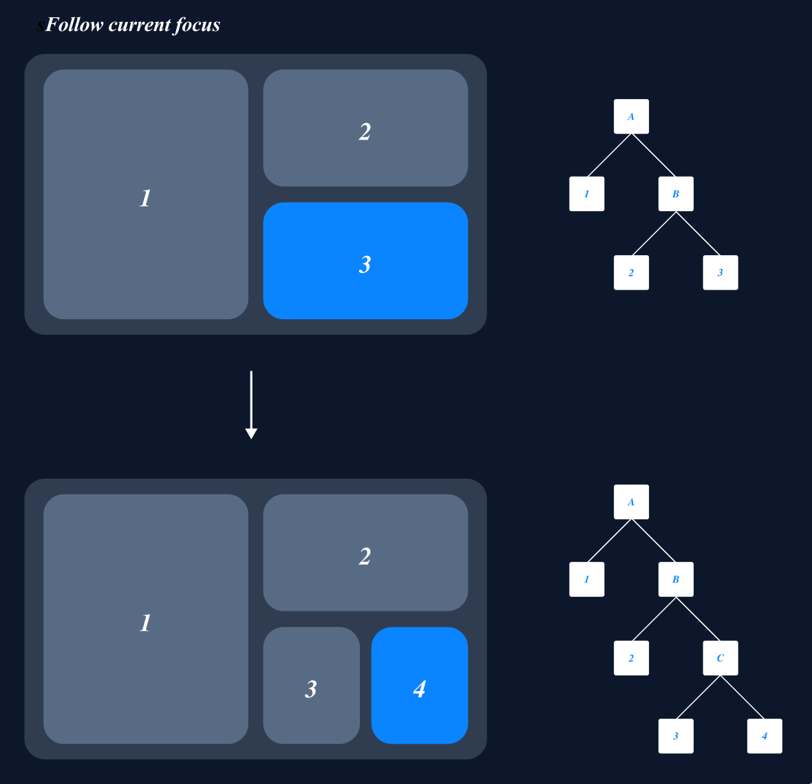
    <p style="font-size:14px;">Figure 3.7 焦点分布</p>
</div>

##### 网格分布（Grid Mode）

此策略试图保持布局树的平衡性，使窗口分布更均匀，避免单边过度嵌套导致的窗口压缩问题：

- 插入窗口时：遍历当前树结构，寻找深度最浅的叶子节点作为插入点，以此保持树结构的对称性与均衡性。
- 删除窗口时：遵循相同的父子结构替换逻辑，但在后续窗口重排时尽可能维持已有平衡性。

<div style="text-align: center;">
    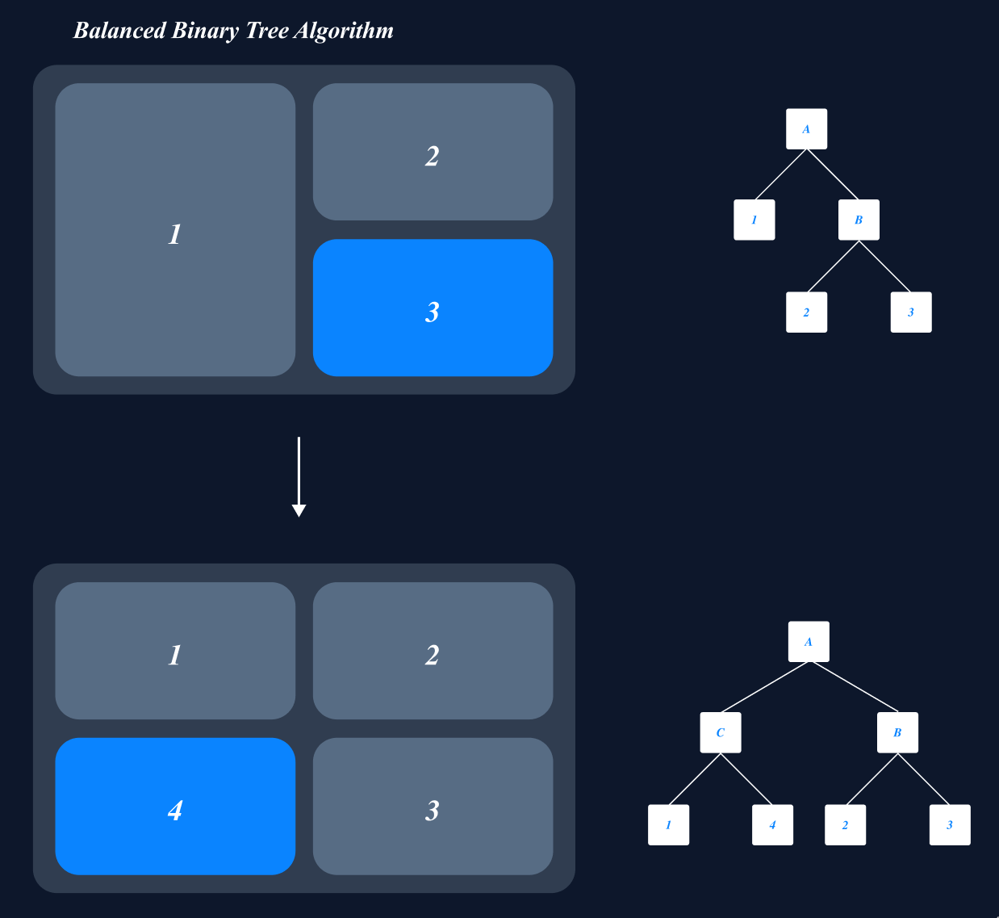
    <p style="font-size:14px;">Figure 3.8 网格分布</p>
</div>

##### 螺旋分布（Sprial Mode）

此策略试图实现螺旋状的窗口分布，以左侧为起始，实现动态美观的布局效果。

- 插入窗口时：记录的 `sprial_node` 为插入节点，插入方向为*右下左上*轮换，按照当前窗口的数量计算得到。
- 删除窗口时：若删除窗口为 `sprial_node` 则设置其兄弟节点为新的 `sprial_node`。

<div style="text-align: center;">
    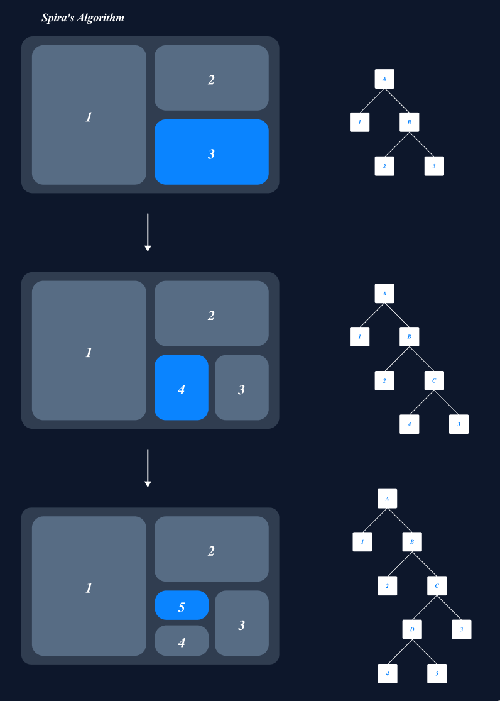
    <p style="font-size:14px;">Figure 3.9 螺旋分布</p>
</div>

#### 3️⃣ 布局树的基本操作

##### 插入窗口

窗口插入遵循当前布局策略，分为以下三个步骤：

1. 确定被插入窗口与插入方向
2. 计算与设置被插入窗口与新插入窗口的大小与位置
3. 修改邻接表

`workspace` 根据布局策略，给定被插入窗口与插入方向，`insert_window()` 函数会完成计算与更新修改，这里的设计非常符合直觉。

```rust
impl TiledTree {
        pub fn insert_window(
        &mut self, 
        target: Option<&Window>, 
        new_window: Window, 
        direction: Direction, 
        space: &mut Space<Window>,
        loop_handle: &LoopHandle<'_, GlobalData>,
    ) -> bool {

        let target = match target {
            Some(window) => window.clone(),
            None => {
                match self.get_first_window() {
                    Some(window) => window.clone(),
                    None => {
                        warn!("Failed to get first window");
                        return false
                    }
                }
            }
        };

        if let Some(target_id) = self.find_node(&target) {
            // resize
            // TODO: use server geometry
            let rec = match space.element_geometry(&target){
                Some(r) => r,
                None => {
                    warn!("Failed to get window rectangle");
                    return false
                }
            };

            let mut original_rec = rec.clone();
            let new_rec = get_new_rec(&direction, &mut original_rec, self.gap);

            // TODO: merge
            target.set_rec(original_rec.size);
            new_window.set_rec(new_rec.size);
            space.map_element(target.clone(), original_rec.loc, false);
            space.map_element(new_window.clone(), new_rec.loc, true);

            // adjust tree
            let old_leaf = self.nodes.insert(NodeData::Leaf { window: target.clone() });
            let new_leaf = self.nodes.insert(NodeData::Leaf { window: new_window.clone() });

            self.spiral_node = Some(new_leaf);

            // use split node hold leafs
            match direction {
                Direction::Left | Direction::Up => {
                    self.nodes[target_id] = NodeData::Split {
                        direction: direction.clone(),
                        rec,
                        offset: (0, 0).into(),
                        left: new_leaf,
                        right: old_leaf,
                    };
                }
                _ => {
                    self.nodes[target_id] = NodeData::Split {
                        direction: direction.clone(),
                        rec,
                        offset: (0, 0).into(),
                        left: old_leaf,
                        right: new_leaf,
                    };
                }   
            }

            // modify neighbor_graph
            self.neighbor_graph.tiled_add(target.clone(), direction.clone(), new_window.clone());

            // TODO: use config
            // create animation
            loop_handle.insert_idle(move |data| {
                data.render_manager.add_animation(
                    target,
                    rec,
                    original_rec,
                    Duration::from_millis(30),
                    crate::animation::AnimationType::EaseInOutQuad,
                );

                let mut from = new_rec;
                match direction {
                    Direction::Right => {
                        from.loc.x += from.size.w;
                    }
                    Direction::Left => {
                        from.loc.x -= from.size.w;
                    }
                    Direction::Up => {
                        from.loc.y -= from.size.h;
                    }
                    Direction::Down => {
                        from.loc.y += from.size.h;
                    }
                }

                data.render_manager.add_animation(
                    new_window,
                    from,
                    new_rec,
                    Duration::from_millis(30),
                    crate::animation::AnimationType::EaseInOutQuad,
                );
            });

            true
        } else {
            false
        }
    }
}

// 工具函数，用于计算新旧窗口的大小与位置
fn get_new_rec(direction: &Direction, rec: &mut Rectangle<i32, Logical>, gap: i32) -> Rectangle<i32, Logical> {

    let mut new_rec = *rec;

    match direction {
        Direction::Left | Direction::Right => {
            let half = rec.size.w / 2 - gap;
            new_rec.size.w = half;
            rec.size.w = half;

            if direction == &Direction::Left {
                rec.loc.x += half + gap;
            } else {
                new_rec.loc.x += half + gap;
            }

            new_rec
        }
        Direction::Up | Direction::Down => {
            let half = rec.size.h / 2 - gap;
            new_rec.size.h = half;
            rec.size.h = half;

            if direction == &Direction::Up {
                rec.loc.y += half + gap;
            } else {
                new_rec.loc.y += half + gap;
            }

            new_rec
        }
    }
}
```

##### 删除窗口

窗口删除操作包含以下四个核心步骤：

- 查找关联节点：通过辅助函数 `find_parent_and_sibling` 定位目标窗口的父节点及其兄弟节点。
- 结构调整与继承布局：
  - 若兄弟节点为 `Leaf`，则继承父节点的 `rec` 并替代父节点位置；
  - 若兄弟节点为 `Split`，则同样继承 `rec`，替代父节点后调用 `modify` 递归更新其子节点的布局信息。
- 清理节点数据：从 `SlotMap` 中移除被删除的窗口节点，保持结构整洁。
- 更新邻接表

```rust
impl TiledTree {

    pub fn remove(&mut self, target: &Window, focus: &mut Option<Window>, space: &mut Space<Window>, loop_handle: &LoopHandle<'_, GlobalData>) -> bool {
        let target_id = match self.find_node(target) {
            Some(r) => {
                r
            }
            None => {
                warn!("Failed to get target_id");
                return false
            }
        };

        // remove last node
        if Some(target_id) == self.root {
            if matches!(self.nodes[target_id], NodeData::Leaf { .. }) {
                self.nodes.remove(target_id);
                self.root = None;
                *focus = None;
                return true;
            }
        }

        let (parent_id, sibling_id) = match self.find_parent_and_sibling(target_id) {
            Some(r) => r,
            None => {
                warn!("Failed to get node: {:?} parent and sibling", target_id);
                return false
            }
        };

        if self.spiral_node == Some(target_id) {
            self.spiral_node = Some(parent_id);
        }

        match self.nodes[parent_id] {
            NodeData::Split { rec, .. } => {
                let sibling_data = match self.nodes.remove(sibling_id){
                    Some(r) => r,
                    None => {
                        warn!("Failed to remove sibling: {:?}", sibling_id);
                        return false
                    }
                };

                match sibling_data {
                    NodeData::Leaf { window } => {
                        let from = space.element_geometry(&window).unwrap();

                        window.set_rec(rec.size);
                        space.map_element(window.clone(), rec.loc, false);

                        self.nodes[parent_id] = NodeData::Leaf { window: window.clone() };

                        if focus.as_ref() == Some(target) {
                            *focus = Some(window.clone());
                        }

                        loop_handle.insert_idle(move |data| {
                            data.render_manager.add_animation(
                                window,
                                from,
                                rec,
                                Duration::from_millis(30),
                                crate::animation::AnimationType::EaseInOutQuad,
                            );
                        });
                    },
                    NodeData::Split { direction, left, right, .. } => {
                        self.nodes[parent_id] = NodeData::Split { 
                            direction, 
                            rec, // from parent
                            offset: (0, 0).into(),
                            left, 
                            right,
                        };
                        self.modify(parent_id, rec, space, loop_handle);

                        if focus.as_ref() == Some(target) {
                            *focus = self.get_first_window().cloned();
                        }

                    }
                }

                self.nodes.remove(target_id);

                true
            },
            NodeData::Leaf { .. } => { 
                false 
            }
        }
    }
}

// 工具函数，复原被删除窗口的兄弟窗口
fn recover_new_rec(rec: Rectangle<i32, Logical>, direction: &Direction, offset: Point<i32, Logical>, gap: i32) -> (Rectangle<i32, Logical>, Rectangle<i32, Logical>) {
    let mut l_rec = rec;
    let mut r_rec = rec;

    match direction {
        Direction::Left | Direction::Right => {
            let half = rec.size.w / 2 - gap;
            l_rec.size.w = half + offset.x;
            r_rec.size.w = half - offset.x;

            r_rec.loc.x += half + gap + offset.x;
        }
        Direction::Up | Direction::Down => {
            let half = rec.size.h / 2 - gap;
            l_rec.size.h = half + offset.y;
            r_rec.size.h = half - offset.y;

            r_rec.loc.y += half + gap + offset.y;
        }
    }

    (l_rec, r_rec)
}
```

##### 倒置窗口

倒置操作主要将 `Split` 类型节点的 `direction` 参数倒置，视觉效果上为水平变竖直，此操作会导致 `rec` 的变化，因此还需要更新所有子节点信息。

主要分为以下三步：

- 找到需要倒置的窗口的父节点。
- 倒置 `direction` 并且使用 `modify` 递归更新当前父元素为根的树。
- 修改邻接表。

```rust
impl TiledTree {
    pub fn invert_window(&mut self, target: &Window, space: &mut Space<Window>, loop_handle: &LoopHandle<'_, GlobalData>){
        let target_id = match self.find_node(target) {
            Some(r) => {
                r
            }
            None => {
                warn!("Failed to get target_id");
                return
            }
        };

        // Only single window
        if self.get_root() == Some(target_id) {
            return;
        }

        let (parent_id, _) = match self.find_parent_and_sibling(target_id) {
            Some(r) => r,
            None => {
                warn!("Failed to get node: {:?} parent and sibling", target_id);
                return
            }
        };

        match &mut self.nodes[parent_id] {
            NodeData::Split { direction, rec , .. } => {
                *direction = direction.rotate_cw();
                let rec = *rec;
                self.modify(parent_id, rec, space, loop_handle);
            },
            NodeData::Leaf { .. } => { }
        }
    }
}
```

##### 列拓展与恢复

此操作实现将所有窗口按照统一大小进行排布。

```rust
impl TiledTree{
    pub fn expansion(&self, space: &mut Space<Window>, loop_handle: &LoopHandle<'_, GlobalData>) {
        if let Some(bound) = self.get_root_rec(space) {
            let width = (bound.size.w - 2*self.gap) / 3;
            let height = bound.size.h;
            let mut loc = bound.loc;

            for node in self.nodes.values() {
                match node {
                    NodeData::Leaf { window } => {
                        let from = space.element_geometry(window).unwrap();

                        window.set_rec((width, height).into());
                        space.map_element(window.clone(), loc, false);

                        let window = window.clone();

                        loop_handle.insert_idle(move |data| {
                            data.render_manager.add_animation(
                                window,
                                from,
                                Rectangle { loc, size: (width, height).into() },
                                Duration::from_millis(30),
                                crate::animation::AnimationType::EaseInOutQuad,
                            );
                        });

                        loc.x = loc.x + width + self.gap;
                    }
                    _ => { }
                }
            }
        }
    }

    pub fn recover(&mut self, space: &mut Space<Window>, loop_handle: &LoopHandle<'_, GlobalData>) {
        if let Some(root_id) = self.get_root() {
            match self.nodes[root_id] {
                NodeData::Split { rec , .. } => {
                    self.modify(root_id, rec, space, loop_handle);
                }
                _ => { }
            }
        }
    }
}
```

### 3.6 动画效果

本吸纳纲目在保持“平铺核心逻辑简洁高效”的前提下，适度引入了 **过渡动画机制**，用于提升用户在窗口焦点切换、窗口布局变换、标签页切换等场景下的感知连贯性。动画不仅是美学设计的体现，更是信息传递与视觉引导的有效方式。

为了保证动画系统的性能和可控性，Mondrain 采用了如下设计原则：

- **最小依赖**：动画系统直接构建在现有渲染框架之上，无引入额外 GUI 框架；

- **状态驱动**：所有动画过渡均由窗口状态变化触发，避免无效重绘；

- **可扩展性强**：动画接口设计后续可插拔，支持不同类型的动画模块（例如弹性缓动、贝塞尔插值等）。

为实现动画效果，**Mondrain 并不直接修改窗口的最终状态数据**，而是采用一种 **“状态解耦、渲染驱动”** 的设计模式：

> 在触发需要动画的操作（如窗口移动、布局切换）时，实际的数据状态立即更新为目标值；  
> 然而，在渲染阶段，窗口的位置与属性并非立刻反映为最终状态，而是通过插值计算出一个**中间状态**，并随着时间推进逐帧更新，直到过渡完成。

这种做法带来两个显著优势：

1. **逻辑状态与渲染状态分离**：窗口管理逻辑保持简洁，不需要等待动画完成即可进行后续操作；

2. **动画过程可中断、可复用**：新的动画触发可以自然地替换旧的过渡轨迹，增强响应性与一致性。

例如，在窗口移动动画中，我们为每个窗口维护一个 `current_rect`（当前渲染位置）和 `target_rect`（逻辑目标位置），渲染时以时间为参数进行插值过渡，而不是一次性跳转。

#### Animation 结构体封装

为了实现动画效果，使用 `Animation` 结构体封装所需内容：

```rust
pub struct Animation {
    from: Rectangle<i32, Logical>,
    to: Rectangle<i32, Logical>,
    elapsed: Duration,
    duration: Duration,
    animation_type: AnimationType,
    pub state: AnimationState,
}

pub enum AnimationState {
    NotStarted,
    Running,
    Completed,
}

pub enum AnimationType {
    Linear,
    EaseInOutQuad,
    OvershootBounce,
}
```

在需要触发动画的时刻，将所需内容进行 `Animation` 被包裹，由 `eventloop` 异步触发，在每一帧渲染时进行过程状态处理，即可实现动画效果。

```rust
impl Animation {
    pub fn new(
        from: Rectangle<i32, Logical>,
        to: Rectangle<i32, Logical>,
        duration: Duration,
        animation_type: AnimationType,
    ) -> Self {
        Self {
            from,
            to,
            elapsed: Duration::ZERO,
            duration,
            animation_type,
            state: AnimationState::new(),
        }
    }

    pub fn start(&mut self) -> Rectangle<i32, Logical> {
        self.elapsed = Duration::ZERO;
        self.state = AnimationState::Running;
        self.from
    }

    pub fn tick(&mut self) {
        self.elapsed += Duration::from_millis(1);
        if self.elapsed >= self.duration {
            self.state = AnimationState::Completed;
        }
    }

    pub fn current_value(&self) -> Rectangle<i32, Logical> {
        let progress = (self.elapsed.as_secs_f64() / self.duration.as_secs_f64()).clamp(0.0, 1.0);
        process_rec(
            self.from,
            self.to,
            self.animation_type.get_progress(progress),
        )
    }
}
```

#### 渲染请求

在窗口渲染阶段，系统首先判断该窗口是否处于动画过程中，即其 `AnimationState` 是否为 `Running`：

- 若动画已在进行中，则根据当前时间计算本帧对应的**中间位置与尺寸**，用于绘制；

- 若动画尚未启动（`AnimationState == Pending`），则立即初始化动画状态，并将其标记为 `Running`，以便从下一帧开始正式执行过渡；

- 若动画已经完成，则会在 `refresh()` 函数下移出动画队列。

- 若动画未绑定动画对象，则直接使用窗口的最终几何状态进行渲染。

通过这种机制，Mondrain 能够在不影响窗口逻辑更新的前提下，实现**按需触发、逐帧驱动**的动画渲染流程，有效提升了动态响应的流畅性和可控性。

```rust
pub struct RenderManager {
    // no need now
    start_time: Instant,
    animations: HashMap<Window, Animation>,
}

...
for window in workspace_manager.elements() {
    let location = match self.animations.get_mut(window) {
        Some(animation) => {
            match animation.state {
                AnimationState::NotStarted => {
                    let rec = animation.start();
                    window.set_rec(rec.size);
                    rec.loc
                }
                AnimationState::Running => {
                    animation.tick();
                    let rec = animation.current_value();
                    window.set_rec(rec.size);
                    // info!("{:?}", rec);
                    rec.loc
                }
                _ => break,
            }
        }
        None => {
            let window_rec = workspace_manager.window_geometry(window).unwrap();
            window_rec.loc
        }
    };
...

pub fn refresh(&mut self) {
    // clean dead animations
    self.animations
        .retain(|_, animation| !matches!(animation.state, AnimationState::Completed));
}
```

#### 实现案例

在触发**窗口插入动画**时，操作会涉及到平铺布局树（即二叉树结构）的结构调整。此过程中，我们能够获取：

- **被调整窗口**的旧位置与新位置（`from → to`）

- **新插入窗口**的初始几何信息（通常为最小化或透明状态）与目标位置

对于这些窗口，我们将其对应的几何变换信息封装为一个 `Animation` 对象，并统一加入到一个 **动画任务队列**中，由事件循环（`eventloop`）逐帧驱动执行。

每一帧中，事件循环会对当前活跃的动画组执行插值更新，通过绘制中间状态实现平滑过渡，直到所有动画到达终点并完成移除。

这种方式实现了：

- 解耦逻辑结构修改与渲染过程

- 支持并发多个窗口动画协同

- 为后续扩展缓动函数、过渡风格等提供良好接口

```rust
...
loop_handle.insert_idle(move |data| {
    data.render_manager.add_animation(
        target,
        rec,
        original_rec,
        Duration::from_millis(30),
        crate::animation::AnimationType::EaseInOutQuad,
    );
    let mut from = new_rec;
    match direction {
        Direction::Right => {
            from.loc.x += from.size.w;
        }
        Direction::Left => {
            from.loc.x -= from.size.w;
        }
        Direction::Up => {
            from.loc.y -= from.size.h;
        }
        Direction::Down => {
            from.loc.y += from.size.h;
        }
    }
    data.render_manager.add_animation(
        new_window,
        from,
        new_rec,
        Duration::from_millis(30),
        crate::animation::AnimationType::OvershootBounce,
    );
});
...
```

### 3.7 拓展协议实现

#### 1️⃣ Layer-Shell 支持

为了实现桌面组件如状态栏、启动器、壁纸容器等持久性窗口，Mondrain 支持 **wlr-layer-shell** 协议。这一协议最初由 wlroots 提出，是实现 Wayland 桌面环境中“系统层级窗口”的标准手段。

`layer-shell` 允许客户端以特定“图层”（layer）方式向合成器注册自身位置、对齐方式、屏幕边缘锚定，以及交互区域排除等属性，用于构建如：

- 层叠浮动窗口（layer: overlay）

- 顶部面板 / 状态栏（layer: top）

- 底部 dock / launcher（layer: bottom）

- 桌面壁纸容器（layer: background）

Mondrain 对该协议的支持不仅满足了桌面组件的功能需求，还为未来实现更多系统级 UI（如通知气泡、任务视图等）提供了良好的基础。

<div style="text-align: center;">
    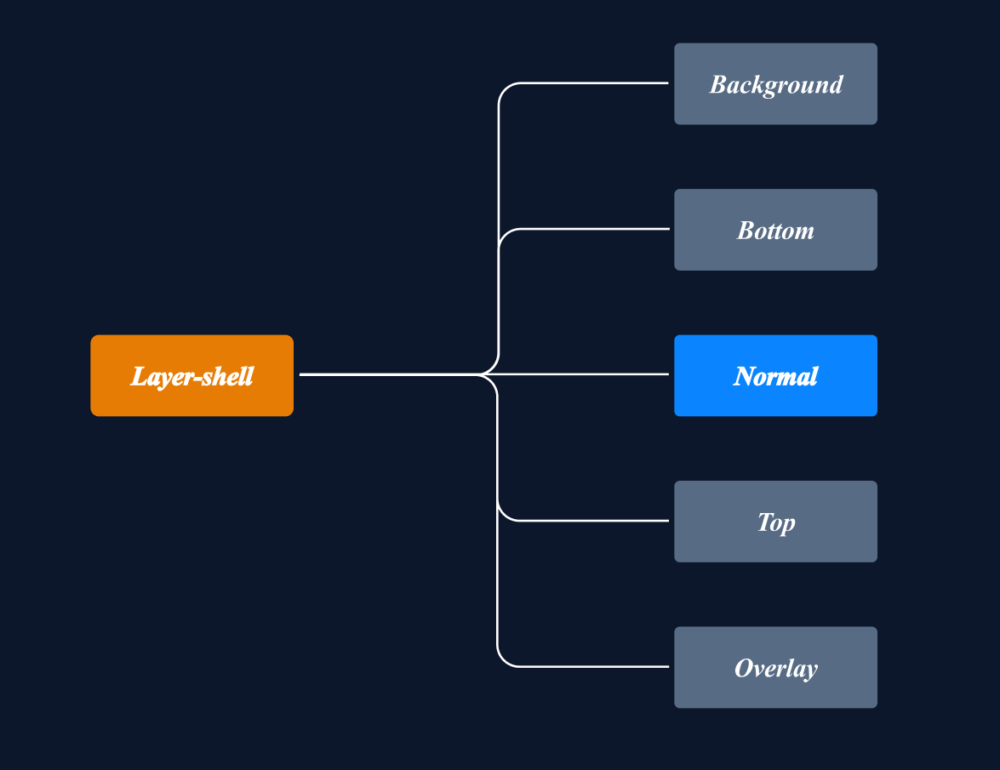
    <p style="font-size:14px;">Figure 3.10 layer_shell 协议演示图</p>
</div>

smithay 中对 `layer-shell` 协议有较好的支持，只需要引用并且构造所需内容即可。

```rust
use smithay::{
    delegate_layer_shell,
    desktop::{LayerSurface, WindowSurfaceType, layer_map_for_output},
    output::Output,
    reexports::wayland_server::protocol::wl_surface::WlSurface,
    wayland::{
        compositor::with_states,
        shell::wlr_layer::{LayerSurfaceData, WlrLayerShellHandler, WlrLayerShellState},
    },
};

use crate::state::GlobalData;

impl WlrLayerShellHandler for GlobalData {
    fn shell_state(&mut self) -> &mut WlrLayerShellState {
        &mut self.state.layer_shell_state
    }

    fn new_layer_surface(
        &mut self,
        surface: smithay::wayland::shell::wlr_layer::LayerSurface,
        wl_output: Option<smithay::reexports::wayland_server::protocol::wl_output::WlOutput>,
        _layer: smithay::wayland::shell::wlr_layer::Layer,
        namespace: String,
    ) {
        let output = if let Some(wl_output) = &wl_output {
            Output::from_resource(wl_output)
        } else {
            // TODO: output_manager -> Option<Output>
            Some(self.output_manager.current_output().clone())
        };

        let Some(output) = output else {
            warn!("no output for new layer surface, closing");
            surface.send_close();
            return;
        };

        let mut map = layer_map_for_output(&output);
        map.map_layer(&LayerSurface::new(surface, namespace))
            .unwrap();
    }

    fn layer_destroyed(&mut self, surface: smithay::wayland::shell::wlr_layer::LayerSurface) {
        // TODO: outputs
        let map = layer_map_for_output(self.output_manager.current_output());
        let layer = map
            .layers()
            .find(|&layer| layer.layer_surface() == &surface)
            .cloned();
        let (mut map, layer) = layer.map(|layer| (map, layer)).unwrap();
        map.unmap_layer(&layer);
    }

    fn new_popup(
        &mut self,
        _parent: smithay::wayland::shell::wlr_layer::LayerSurface,
        popup: smithay::wayland::shell::xdg::PopupSurface,
    ) {
        self.unconstrain_popup(&popup);
    }
}
delegate_layer_shell!(GlobalData);

impl GlobalData {
    pub fn layer_shell_handle_commit(&mut self, surface: &WlSurface) -> bool {
        let output = self.output_manager.current_output();

        let mut map = layer_map_for_output(output);

        if map
            .layer_for_surface(surface, WindowSurfaceType::TOPLEVEL)
            .is_some()
        {
            let initial_configure_sent = with_states(surface, |states| {
                states
                    .data_map
                    .get::<LayerSurfaceData>()
                    .unwrap()
                    .lock()
                    .unwrap()
                    .initial_configure_sent
            });

            map.arrange();
            if !initial_configure_sent {
                let layer = map
                    .layer_for_surface(surface, WindowSurfaceType::TOPLEVEL)
                    .unwrap();

                layer.layer_surface().send_configure();
            }

            return true;
        }

        false
    }
}
```

## 4. 项目测试与性能分析

### 4.1 Rust tracing

### 4.2 帧率测试

### 4.3 GPU 压力测试