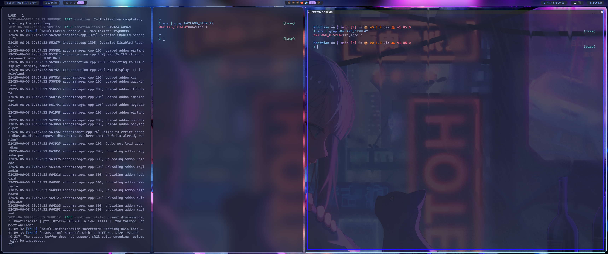
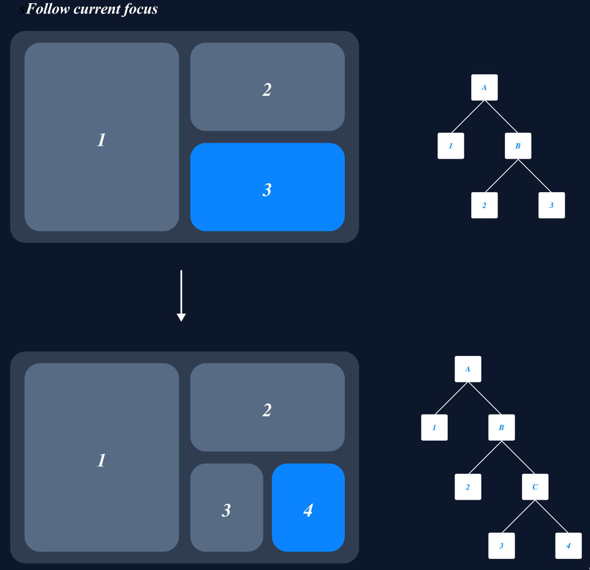
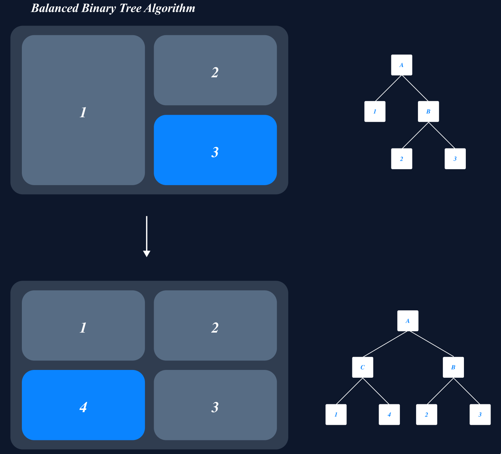
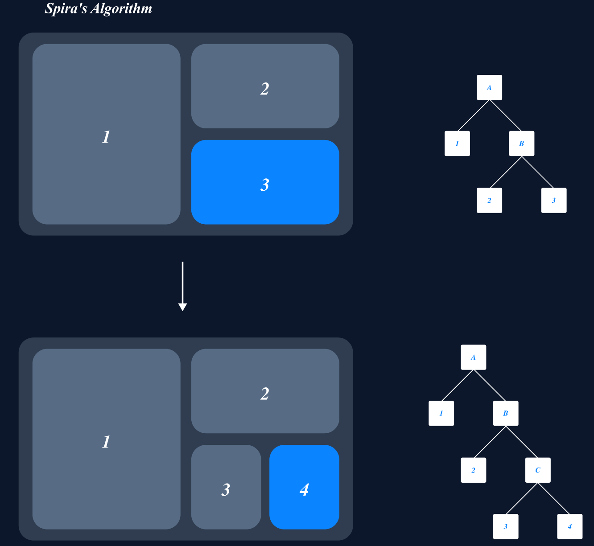

## 项目功能完全展示

## 后端启动

### Winit 嵌套模式

`Mondrian`

### TTY 裸机直连

## 窗口布局逻辑

### 多种平铺式布局方案

## 动画效果

### 新建窗口

### 交换排布方向

### 窗口展开

### 窗口恢复

### 更改大小

### 交换邻近窗口

### 删除窗口

## 输入设备监听

### 鼠标移动

### 鼠标滚轮移动

### 鼠标点击

### 键盘输入

### 自定义快捷键

## 远程桌面

## 性能测试
