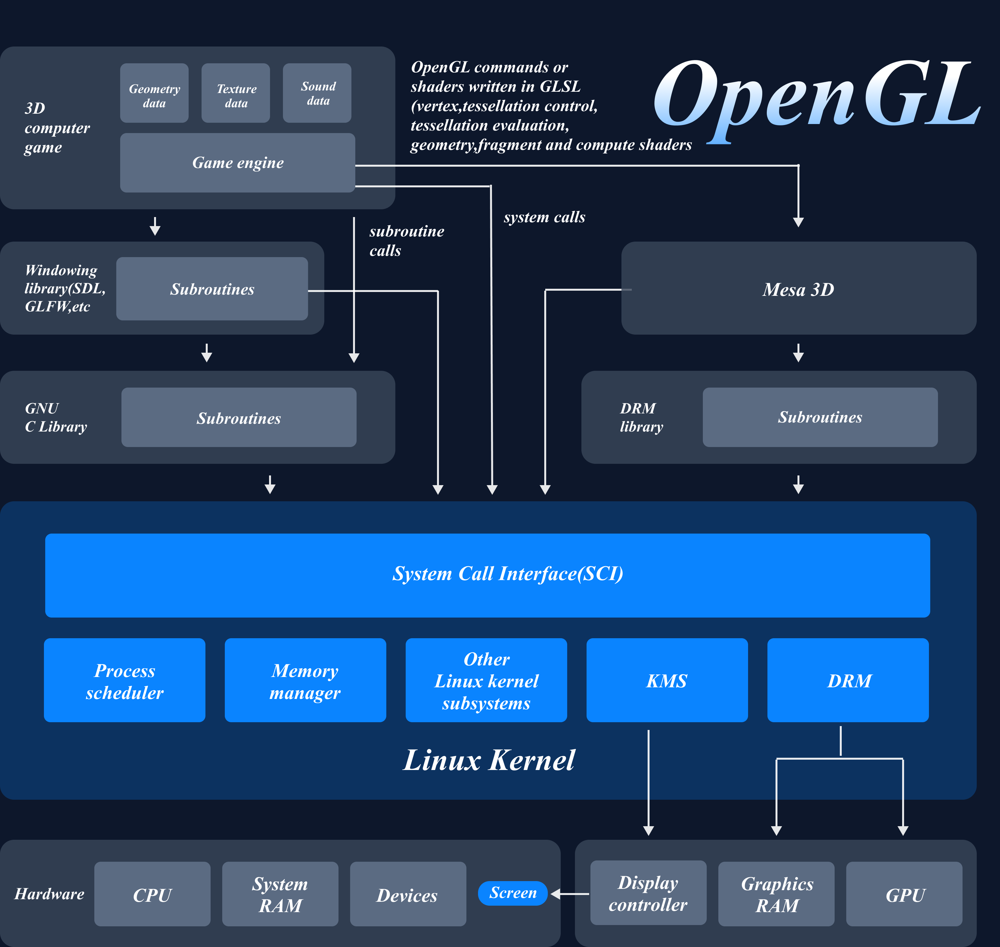

## TTY 裸机模式下的 GPU 直连启动

本项目是一个使用 Rust 编写的 Wayland Compositor，具备在 TTY 模式下直接启动的能力，无需依赖 X11、GDM 或其他图形会话管理器。项目在裸机终端中自行初始化 DRM/KMS 图形管线，并通过 GBM 和 EGL 建立 GPU 渲染上下文，使用 OpenGL ES 进行硬件加速合成显示。启动后该 Compositor 接管系统图形输出，并成为客户端程序（如终端模拟器、浏览器）的 Wayland 显示服务。

- [TTY 裸机模式下的 GPU 直连启动](#tty-裸机模式下的-gpu-直连启动)
  - [1. Linux 图形栈核心技术组件](#1-linux-图形栈核心技术组件)
    - [1.1 OpenGL/GLES](#11-openglgles)
    - [1.2 EGL](#12-egl)
    - [1.3 GBM（Generic Buffer Management）](#13-gbmgeneric-buffer-management)
    - [1.4 Mesa3D](#14-mesa3d)
    - [1.5 DRM（Direct Rendering Manager）](#15-drmdirect-rendering-manager)
      - [GEM（Graphic Execution Manager）](#gemgraphic-execution-manager)
      - [KMS（Kernel Mode Setting）](#kmskernel-mode-setting)
    - [1.6 libinput/evdev](#16-libinputevdev)
  - [2. Wayland 通信流程与显示流程](#2-wayland-通信流程与显示流程)
    - [2.1 通信流程概述](#21-通信流程概述)
      - [客户端连接与交互](#客户端连接与交互)
      - [Buffer 获取与提交](#buffer-获取与提交)
      - [合成器接管 buffer 并合成](#合成器接管-buffer-并合成)
      - [GPU 渲染与提交](#gpu-渲染与提交)
      - [Page Flip 显示与 VBlank 同步](#page-flip-显示与-vblank-同步)
    - [2.2 输入事件处理流程](#22-输入事件处理流程)
  - [3. 代码实现细节](#3-代码实现细节)
  - [参考文献](#参考文献)


### 1. Linux 图形栈核心技术组件

<div align = center>
    
    <p style="font-size:14px;">Figure 1 Linux渲染图形栈</p>
</div>

用画廊来举例，会比较容易理解。

画师就是 OpenGL/GLES，用于绘制用户提交的绘制需求，在绘制之前，画廊陈列员（EGL）
会负责与库存管理员（GBM）联系，确定好最终需要陈放画框的大小（buffer size），位置（egl buffer 映射）以及一些其他内容（egl context）。画师绘制完图画以后，先将图画堆积到队列中（queue frame），时机到达后（VBlank）就将原先墙上的画拿下，然后挂上新的画（page flip）。

下面是正式的介绍。

#### 1.1 OpenGL/GLES

OpenGL（Open Graphics Library） 与其精简版 OpenGL ES（Embedded Systems） 是广泛使用的跨平台图形渲染 API，用于执行图形计算和渲染操作。在嵌入式或资源受限的环境中，OpenGL ES 更为常用，其接口更加轻量，适合直接在 TTY 裸机模式下运行。

在本项目中，OpenGL ES 被用于执行 GPU 加速的图形渲染任务。具体包括：
- 几何图形的绘制（如窗口、装饰、阴影）；
- 着色器程序的编译与执行；
- 将渲染内容输出到帧缓冲（Framebuffer）中，供后续显示。

在 TTY 裸机模式下，合成器通过 OpenGL ES 执行图形绘制操作，如几何图元绘制、纹理映射和着色器执行，最终将图像渲染到 GPU 管理的缓冲区（Framebuffer）中。

#### 1.2 EGL

EGL 是连接 OpenGL ES 与本地窗口系统（如 X11、Wayland、或裸设备如 GBM）的中间接口库。其职责包括：
- 初始化图形上下文；
- 创建渲染表面（EGLSurface）；
- 在渲染器与底层硬件（GBM、DRM）之间建立连接；
- 管理 buffer swap（如 eglSwapBuffers()）与同步机制。

在 TTY 环境中，EGL 通常与 GBM 配合使用，将 GPU buffer 分配出来供 OpenGL ES 使用，建立渲染到显示设备之间的桥梁。

#### 1.3 GBM（Generic Buffer Management）

GBM 是 Mesa 提供的一个用于和内核 DRM 系统交互的库，它的主要功能是：
- 分配可被 GPU 渲染的缓冲区（bo：buffer object）；
- 将这些缓冲区导出为 DMA-BUF handle，用于与 DRM 或其他进程共享；
- 为 EGL 提供可渲染的 EGLNativeWindowType。

GBM 允许在没有窗口系统的场景下（如 TTY 模式）创建 OpenGL 可用的 framebuffer，从而支持嵌入式系统和裸机合成器的图形输出。

#### 1.4 Mesa3D

Mesa3D 是开源图形栈的核心，提供了 OpenGL、OpenGL ES、EGL、GBM 等多个图形接口的完整实现。它在用户空间运行，并与内核空间的 DRM 驱动协同工作。

Mesa 提供以下功能：
- 实现 OpenGL / GLES API，并将其转译为 GPU 硬件可识别的命令；
- 管理 shader 编译、状态机、纹理、缓冲区等所有渲染细节；
- 实现 GBM 与 DRM 的绑定，支持 buffer 分配与传输；
- 调度 page flip 请求，通过 DRM 与显示硬件同步。

#### 1.5 DRM（Direct Rendering Manager）

***直接渲染管理器***（Direct Rendering Manager，缩写为 DRM）是 Linux 内核图形子系统的一部分，负责与 GPU（图形处理单元）通信。它允许用户空间程序（如图形服务器或 Wayland compositor）通过内核公开的接口，完成以下关键任务：

- 分配和管理图形缓冲区（buffer）
- 设置显示模式（分辨率、刷新率等）
- 与显示设备（显示器）建立连接
- 将 GPU 渲染结果显示到屏幕上 - PageFlip 页面翻转

DRM 是现代 Linux 图形栈的基础，允许程序绕过传统 X Server，直接操作 GPU，形成了“GPU 直连”的渲染路径。

<div align = center>
    
    <p style="font-size:14px;">Figure 2 DRM</p>
</div>

要想理解 DRM ，首先要理解两个关键子模块的工作内容：

##### GEM（Graphic Execution Manager）

***图形执行管理器***（Graphics Execution Manager，简称 GEM）是 DRM 子系统中的另一个重要模块，主要用于内存管理，即如何分配和管理 GPU 可访问的图形缓冲区（buffer）。

它提供了如下功能：
- 为用户空间分配 GPU 使用的显存或系统内存缓冲区
- 提供缓冲区在用户空间与内核空间之间的共享与引用机制
- 管理缓冲区的生命周期和同步（避免读写冲突）

帧缓冲区对象（framebuffer）是帧内存对象的抽象，它提供了像素源给到 CRTC。帧缓冲区依赖于底层内存管理器分配内存。

在程序中，使用 DRM 接口创建 framebuffer、EGL 创建的渲染目标，底层通常都通过 GEM 管理。GEM 的存在使得多种图形 API（OpenGL ES、Vulkan、视频解码等）可以统一、高效地访问 GPU 资源。

##### KMS（Kernel Mode Setting）

***内核模式设置***（Kernel Mode Setting，简称 KMS）是 DRM 的子系统，用于控制显示设备的“输出路径”，即显示管线。它允许在内核空间完成分辨率设置、刷新率调整、帧缓冲切换等操作，而不依赖用户空间的图形服务器。

KMS 将整个显示控制器的显示 pipeline 抽象成以下几个部分：
- Plane（图层）
    
    每个 plane 表示一块可渲染的图像区域，可独立组合显示输出。plane 分为三类：
    - Primary：主图层，必需。对应于整个屏幕内容，通常显示整个帧缓冲区。
    - Cursor：用于显示鼠标光标，通常是一个小图层，支持硬件加速。
    - Overlay：可选的叠加图层，用于视频加速或硬件合成。

- CRTC（Cathode Ray Tube Controller）

    控制图像从 plane 传送到 encoder，类似一个“图像流控制器”，主要用于管理显示设备的扫描和刷新。一个 CRTC 通常绑定一个主 plane，但也可能支持多个 overlay。

- Encoder（编码器）

    将图像信号从 GPU 转换为特定格式，如 HDMI、DP、eDP、VGA 等。

- Connector（连接器）

    表示实际的物理接口（如 HDMI 接口、DisplayPort 接口），对应连接的显示设备（monitor）。

> 🔄 工作流程示意：Plane → CRTC → Encoder → Connector → 屏幕

#### 1.6 libinput/evdev

evdev（Event Device） 是 Linux 内核提供的一个通用输入事件接口，所有输入设备（键盘、鼠标、触控板、游戏手柄等）在内核中都会以 /dev/input/eventX 设备节点的形式暴露，用户空间可以通过这些节点读取输入事件（如按键、移动、点击等）。

然而，直接与 evdev 接口打交道较为繁琐、底层，且各类设备的事件语义不尽相同。因此，在现代图形系统中，通常借助 libinput 作为更高级的输入事件处理库。

libinput 是一个*用户空间库*，提供统一的输入设备管理接口，具备以下功能：
- 统一处理来自 evdev 的事件流；
- 解析输入事件，生成高级抽象（如双指滚动、滑动、手势等）；
- 管理输入设备的生命周期（添加、移除）；
- 提供输入设备的识别信息（厂商、型号、功能等）；
- 与 Wayland compositor 无缝集成，支持多种后端（如 udev、seatd）。

### 2. Wayland 通信流程与显示流程

本项目实现了一个独立于 X11、无需任何桌面环境即可运行的 Wayland 合成器（compositor），通过直接接管 TTY 并使用 DRM/KMS 完成图形显示。在显示系统的构建中，Wayland 扮演的是 图形系统通信协议 的角色，而具体的渲染、显示和输入处理由 DRM、GBM、EGL 与 libinput 等模块协同完成。

Wayland 合成器的主要职责是：
- 接受客户端（Wayland client）的连接与绘图请求
- 将客户端 buffer 进行合成、渲染并显示在屏幕上
- 处理来自内核的输入事件

```
[Wayland Client]
    ↓ 提交 buffer（wl_buffer / linux-dmabuf）
[Compositor]
    ↓ OpenGL 合成（将多个窗口 buffer 组合）
[Framebuffer]
    ↓ DRM 显示 pipeline（crtc → encoder → connector）
[Monitor Output]
```

#### 2.1 通信流程概述

##### 客户端连接与交互

每个 Wayland 客户端通过 Socket 与合成器通信，注册所需协议（如 wl_surface, xdg_surface），并通过共享内存或 GPU buffer 提交其绘制内容。

##### Buffer 获取与提交

客户端通过 wl_buffer 协议提供绘制完成的内容。这个 buffer 可能来自：
- wl_shm：CPU 绘制后的共享内存（较慢）
- linux-dmabuf：GPU 渲染结果，零拷贝

##### 合成器接管 buffer 并合成

合成器在服务端接收 attach / commit 请求后，将客户端的 buffer 记录为当前帧的一部分。在下一帧刷新中，所有窗口的 buffer 会被 GPU 合成到一个输出 surface 上。

##### GPU 渲染与提交
    
使用 OpenGL ES 渲染这些 buffer（如绘制窗口、阴影、边框等），再通过 eglSwapBuffers 提交帧缓冲，交由 DRM 显示。

##### Page Flip 显示与 VBlank 同步

合成后的 framebuffer 通过 drmModePageFlip 提交，等待垂直同步（VBlank）时切换至新帧，防止 tearing。

#### 2.2 输入事件处理流程

合成器使用 libinput 接管来自内核的输入事件（通过 evdev 设备），包括：

- 键盘事件（按键、组合键）
- 鼠标移动 / 点击 / 滚动
- 触控板 / 手势识别（如双指缩放、滑动）

输入事件首先由 Compositor 进行解析，无需响应时间时，发送给对应拥有 keyboard, pointer, touch focus 的客户端，通过协议如 wl_pointer.motion, wl_keyboard.key, wl_touch.down 等完成回传。

### 3. 代码实现细节

Tty 后端部分代码量过大，这里只解释核心的代码部分。

基本数据结构：
```rust
pub struct Tty {
    pub session: LibSeatSession,
    pub libinput: Libinput,
    pub gpu_manager: GpuManager<GbmGlesBackend<GlesRenderer, DrmDeviceFd>>,
    pub primary_node: DrmNode,
    pub primary_render_node: DrmNode,
    pub devices: HashMap<DrmNode, OutputDevice>,
    pub seat_name: String,
    pub dmabuf_global: Option<DmabufGlobal>,
}

pub struct OutputDevice {
    token: RegistrationToken,
    render_node: DrmNode,
    drm_scanner: DrmScanner,
    surfaces: HashMap<crtc::Handle, Surface>,
    #[allow(dead_code)]
    active_leases: Vec<DrmLease>,
    drm: DrmDevice,
    gbm: GbmDevice<DrmDeviceFd>,

    // record non_desktop connectors such as VR headsets
    // we need to handle them differently
    non_desktop_connectors: HashSet<(connector::Handle, crtc::Handle)>,
}

pub struct Surface {
    output: Output,
    #[allow(dead_code)]
    device_id: DrmNode,
    render_node: DrmNode,
    compositor: GbmDrmCompositor,
    dmabuf_feedback: Option<SurfaceDmabufFeedback>,
}
```

这里主要维护三个数据结构，Tty 为总后端，其持有多个 OutputDevice，也就是 GPU 设备，每个 GPU 设备可能会持有多个 Surface，对应的是显示器。

Tty 中还获取记录主 GPU 节点与其渲染节点，输入设备管理器名称等

```rust
impl Tty {
    pub fn new(loop_handle: &LoopHandle<'_, GlobalData>) -> anyhow::Result<Self> {
        // Initialize session
        let (session, notifier) = LibSeatSession::new()?;
        let seat_name = session.seat();

        let mut libinput = Libinput::new_with_udev::<LibinputSessionInterface<LibSeatSession>>(
            session.clone().into(),
        );
        libinput.udev_assign_seat(&seat_name).unwrap();
        let libinput_backend = LibinputInputBackend::new(libinput.clone());

        loop_handle
            .insert_source(libinput_backend, |mut event, _, data| {
                if let InputEvent::DeviceAdded { device } = &mut event {
                    info!("libinput Device added: {:?}", device);
                    if device.has_capability(DeviceCapability::Keyboard) {
                        if let Some(led_state) = data.input_manager.seat.get_keyboard().map(|keyboard| {
                            keyboard.led_state()
                        }) {
                            info!("Setting keyboard led state: {:?}", led_state);
                        }
                    }
                } else if let InputEvent::DeviceRemoved { ref device } = event {
                    info!("libinput Device removed: {:?}", device);
                }
                data.process_input_event(event);
            })
            .unwrap();

        loop_handle
            .insert_source(notifier, move |event, _, data| match event {
                SessionEvent::ActivateSession => {
                    info!("Session activated");
                    if data.backend.tty().libinput.resume().is_err() {
                        warn!("error resuming libinput session");
                    };

                }
                SessionEvent::PauseSession => {
                    info!("Session paused");
                    data.backend.tty().libinput.suspend();
                    for device in data.backend.tty().devices.values_mut() {
                        device.drm.pause();
                    }
                }
            })
            .unwrap();

        // Initialize Gpu manager
        let api = GbmGlesBackend::with_context_priority(ContextPriority::Medium);
        let gpu_manager = GpuManager::new(api).context("error creating the GPU manager")?;

        let primary_gpu_path = udev::primary_gpu(&seat_name)
            .context("error getting the primary GPU")?
            .context("couldn't find a GPU")?;

        info!("using as the primary node: {:?}", primary_gpu_path);

        let primary_node = DrmNode::from_path(primary_gpu_path)
            .context("error opening the primary GPU DRM node")?;

        info!("Primary GPU: {:?}", primary_node);

        // get render node if exit - /renderD128
        let primary_render_node = primary_node
            .node_with_type(NodeType::Render)
            .and_then(Result::ok)
            .unwrap_or_else(|| {
                warn!("error getting the render node for the primary GPU; proceeding anyway");
                primary_node
            });

        let primary_render_node_path = if let Some(path) = primary_render_node.dev_path() {
            format!("{:?}", path)
        } else {
            format!("{}", primary_render_node)
        };
        info!("using as the render node: {}", primary_render_node_path);

        Ok(Self {
            session,
            libinput,
            gpu_manager,
            primary_node,
            primary_render_node,
            devices: HashMap::new(),
            seat_name,
            dmabuf_global: None,
        })
    }
}
```

`Tty::new()` 主要做了以下几件事：
- 监听 libinput 输入事件
- 监听 session 事件
- 初始化 gbm，获取主 GPU 信息

```rust
impl Tty{
    pub fn init(
        &mut self,
        loop_handle: &LoopHandle<'_, GlobalData>,
        display_handle: &DisplayHandle,
        output_manager: &mut OutputManager,
        render_manager: &RenderManager,
        state: &mut State,
    ) {
        let udev_backend = UdevBackend::new(&self.seat_name).unwrap();

        // gpu device
        for (device_id, path) in udev_backend.device_list() {
            if let Ok(node) = DrmNode::from_dev_id(device_id) {
                if let Err(err) = self.device_added(
                    loop_handle,
                    display_handle,
                    node, 
                    &path, 
                    output_manager, 
                    render_manager,
                    state,
                ) {
                    warn!("erro adding device: {:?}", err);
                }
            }
        }

        let mut renderer = self.gpu_manager.single_renderer(&self.primary_render_node).unwrap();

        state.shm_state.update_formats(
            renderer.shm_formats(),
        );

        match renderer.bind_wl_display(display_handle) {
            Ok(_) => info!("EGL hardware-acceleration enabled"),
            Err(err) => info!(?err, "Failed to initialize EGL hardware-acceleration"),
        }

        loop_handle
            .insert_source(udev_backend, move |event, _, data| match event {
                UdevEvent::Added { device_id, path } => {
                    if let Ok(node) = DrmNode::from_dev_id(device_id) {
                        if let Err(err) = data.backend.tty().device_added(
                            &data.loop_handle,
                            &data.display_handle,
                            node,
                            &path,
                            &mut data.output_manager,
                            &data.render_manager,
                            &mut data.state,
                        ) {
                            warn!("erro adding device: {:?}", err);
                        }
                    }
                }
                UdevEvent::Changed { device_id } => {
                    if let Ok(node) = DrmNode::from_dev_id(device_id) {
                        data.backend.tty().device_changed(
                            node,
                            &mut data.output_manager,
                            &data.display_handle,
                        )
                    }
                }
                UdevEvent::Removed { device_id } => {
                    if let Ok(node) = DrmNode::from_dev_id(device_id) {
                        data.backend.tty().device_removed(
                            &data.loop_handle,
                            &data.display_handle,
                            node, 
                            &mut data.output_manager,
                            &mut data.state,
                        );
                    }
                }
            })
            .unwrap();

        loop_handle.insert_idle(move |data| {
            info!(
                "The tty render start at: {:?}",
                data.clock.now().as_millis()
            );
            // TODO: use true frame rate
            let duration = Duration::from_millis(1000 / 100);
            let next_frame_target = data.clock.now() + duration;
            let timer = Timer::from_duration(duration);
            data.next_frame_target = next_frame_target;

            data.loop_handle
                .insert_source(timer, move |_, _, data| {
                    // info!(
                    //     "render event, time: {:?}, next_frame_target: {:?}",
                    //     data.clock.now().as_millis(),
                    //     data.next_frame_target.as_millis()
                    // );
                    if data.clock.now() > data.next_frame_target + MINIMIZE {
                        // drop current frame, render next frame
                        info!("jump the frame");
                        data.next_frame_target = data.next_frame_target + duration;
                        let new_duration = Duration::from(data.next_frame_target)
                            .saturating_sub(data.clock.now().into());
                        return TimeoutAction::ToDuration(new_duration);
                    }

                    data.backend.tty().render_output(
                        &mut data.render_manager,
                        &data.output_manager,
                        &data.workspace_manager,
                        &mut data.cursor_manager,
                        &data.input_manager,
                    );

                    // For each of the windows send the frame callbacks to tell them to draw next frame.
                    data.workspace_manager.elements().for_each(|window| {
                        window.send_frame(
                            data.output_manager.current_output(),
                            data.start_time.elapsed(),
                            Some(Duration::ZERO),
                            |_, _| Some(data.output_manager.current_output().clone()),
                        )
                    });

                    data.workspace_manager.refresh();
                    data.popups.cleanup();
                    data.display_handle.flush_clients().unwrap();

                    data.next_frame_target = data.next_frame_target + duration;
                    let new_duration = Duration::from(data.next_frame_target)
                        .saturating_sub(data.clock.now().into());

                    TimeoutAction::ToDuration(new_duration)
                })
                .unwrap();

            data.backend.tty().render_output(
                &mut data.render_manager,
                &data.output_manager,
                &data.workspace_manager,
                &mut data.cursor_manager,
                &data.input_manager,
            );
        });
    }
}
```

`Tty::init()` 主要完成以下几件事：
- 监听 udev，获取所有 GPU 设备以及其对应的显示器信息
- 按照给定帧率执行渲染流程

本项目目前只实现了单 GPU 单显示器固定帧率渲染，渲染部分主要按照此流程重复执行：

```
render_output() // 渲染指定显示器上的内容
↓
queue_frame() // 将渲染好的内容送至等待队列，等待 pageflip
↓
VBlank // 垂直同步信号
↓
frame_submmit() // 提交帧，执行 pageflip
```

### 参考文献

[https://blog.deepin.org/posts/drm/](https://blog.deepin.org/posts/drm/)