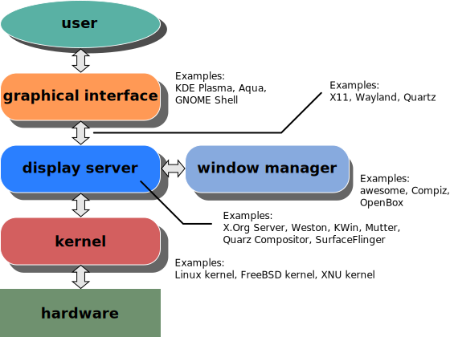

## wayland-protocol

### Linux 图形栈

在 Linux 操作系统中，图形显示系统由多个层级组成，从底层的内核显卡驱动到用户态的图形协议，再到最终的 GUI 应用。整个图形栈主要包括以下几部分：

- **内核层（Kernel Space）**：
  
  - `DRM（Direct Rendering Manager）`：管理 GPU 资源与帧缓冲控制。
  - `KMS（Kernel Mode Setting）`：用于设置显示模式，如分辨率、刷新率等。
  - `GBM（Generic Buffer Management）`：用于创建与管理图形缓冲区。

- **中间层**：
  
  - `Mesa`：用户态 OpenGL/Vulkan 实现，提供图形驱动接口。
  - `EGL`：抽象图形上下文与窗口系统之间的接口，衔接 OpenGL 与窗口系统（如 Wayland）。

- **用户层协议（User Space Protocol）**：
  
  - `X11`：传统的图形协议，拥有复杂的客户端-服务器模型。
  - `Wayland`：现代协议，注重简洁、高效、低延迟。

- **图形服务器（Display Server）**：
  
  - `Xorg`：X11 协议的标准实现。
  - `Wayland Compositor`：Wayland 协议的实现方，集成合成器、窗口管理器、输入系统。

- **应用层**：
  
  - GUI 应用程序通过协议与服务器通信，实现窗口创建、绘图与事件交互。

    
    
Figure 1 from upload.wikimedia.org

    
    
Figure 2 By Shmuel Csaba Otto Traian, CC BY-SA 3.0, https://commons.wikimedia.org/w/index.php?curid=29272912

### X11 协议

X11 是诞生于 1984 年的图形窗口系统，其核心是 **客户端-服务器** 架构：

- **X Server**：运行在用户机器上，控制显示硬件，处理输入事件。
- **X Clients**：运行应用程序，向 X Server 请求窗口资源，并响应事件回调。

X11 协议支持网络透明性，即 X Client 和 X Server 可以运行在不同主机上。但其通信模型较为复杂：

- 每个窗口请求都需往返服务器确认（Round Trip），带来额外延迟。
- 图形渲染与窗口管理被分离为多个组件（如 WM、Compositor、Toolkit），难以协调。
- 输入事件先由 X Server 捕获，后由 Window Manager 转发，路径冗长且易出现冲突。

尽管历经多年优化，X11 的架构问题已难以适应现代图形性能与安全性的需求。

    
    
Figure 3 from upload.wikimedia.org

### Wayland 协议

Wayland 是设计用于替代 X11 的现代图形协议，由 [wayland.freedesktop.org](https://wayland.freedesktop.org) 开发，强调 **简洁、安全、高性能**。其基本架构如下：

- **Compositor（合成器）即 Display Server**：
  
  - 直接管理窗口、图像合成与缓冲交换。
  - 处理输入事件，并直接分发到正确的客户端。
  - 实现窗口管理逻辑（如平铺、浮动等）。

- **Client 应用程序**：
  
  - 负责自行渲染窗口内容（通过 GPU 渲染或 CPU 绘图）。
  - 使用 `wl_surface` 等原语将渲染结果提交给 Compositor。
  - 与 Compositor 通过共享内存或 DMA Buffer 实现高效图像交换。

- **协议交互机制**：
  
  - 基于 Unix Domain Socket 通信，使用 `wl_display` 进行连接。
  - 使用对象-事件模型（Object/Interface），类似面向对象远程调用。
  - 无需往返确认，大部分请求为异步执行，提高响应效率。

### Wayland 协议的优势

相比 X11，Wayland 协议具有以下核心优势：

#### 1. 简洁的架构设计

Wayland 取消了中间代理（如 Xlib/XCB），让客户端直接负责渲染，Compositor 仅做图像合成与事件路由。这种 **单一控制点设计** 更加清晰易控。

#### 2. 异步通信模型

大多数请求为 **异步非阻塞**，大幅降低绘制窗口所需的 round-trip，提升性能表现，尤其在高帧率与多窗口场景下优势明显。

#### 3. 安全性与隔离性更好

- Compositor 全面控制窗口焦点、输入与输出，不再暴露全局窗口信息。
- 各客户端窗口互不可见（无法监听或操作其他窗口）。
- 支持权限隔离（如输入抓取限制、屏幕截图权限控制等）。

#### 4. 动态扩展能力强

Wayland 协议采用模块化设计，核心协议只定义基础对象（如 `wl_surface`, `wl_output`），其他功能由 **扩展协议（Protocol Extensions）** 提供，例如：

- `xdg-shell`：提供桌面窗口接口（如 toplevel/popup）。
- `wlr-layer-shell`：支持桌面元素（如面板、壁纸）。
- `xdg-output`：扩展输出信息。
- `pointer-gestures`：添加手势支持。

#### 5. 原生合成支持

每个窗口的图像由 Client 渲染后交给 Compositor 直接合成，因此：

- 减少了冗余图层绘制流程。
- 更容易实现视觉效果（圆角、阴影、动画）。
- 支持真正的无撕裂与高刷新率渲染。
